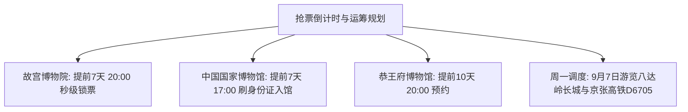

# 2026 北京 6 天 5 晚首都文化与皇家世界遗产深度研学专案

> **方案编号**：PLAN-2026-BJ-001  
> **方案定制机构**：华夏纵横文旅智库旅行社  
> **出行周期**：2026 年 9 月 5 日（周六晨广州出港）至 9 月 10 日（周四晨离京/转场）· 6 天 5 晚  
> **始发枢纽**：广州白云国际机场 (CAN) · 国航 CA8691 直飞北京大兴 (PKX)  
> **目的地枢纽**：北京市（东城、西城、海淀、朝阳、延庆）  
> **专家联合签发**：总负责人 陆承远 · 线路总架构 程若曦 · 特级导游 卫国强 · 历史学者 梁思涵 博士 · 地理学者 顾玄石 博士  
> **合规执行标准**：SOP-GOV-2026-001 内容真实性与商业实体四要素核验标准

---

## 1. 专案概览与核心地标

本方案为华夏文脉深度出行的**第一阶段（北轴 · 6天5晚首都文脉探索）**，涵盖 5 处 UNESCO 世界文化遗产及国家级文博殿堂：

1. **故宫博物院（紫禁城）**：明清 24 位帝王理政起居之所，中轴三大殿与珍宝馆九龙壁；
2. **景山公园（万春亭）**：北京中轴线制高点，360 度俯瞰紫禁城金顶全景与中轴对称布局；
3. **八达岭长城（天下第一雄关 · 京张高铁直达）**：居庸之险不在关而在八达岭，北门锁钥，北八楼海拔 888 米好汉坡最高峰，乘京张高铁 D6705 直达地下 102 米车站，安排于周一（巧避市区文博闭馆）；
4. **中国国家博物馆**：“古代中国”通史展（后母戊鼎、四羊方尊、击鼓说唱俑、金缕玉衣）；
5. **恭王府博物馆**：“一座恭王府，半部清代史”，月牙河水法与秘云洞康熙御笔“福”字碑；
6. **颐和园 & 圆明园**：万寿山佛香阁、昆明湖画舫、728 米长廊与西洋楼大水法残垣；
7. **天坛公园**：古代祭天与祈谷圣地，祈年殿三重纯木攒尖顶与回音壁声学奇迹；
8. **老城胡同与市井烟火**：什刹海后海、银锭桥、烟袋斜街、前门大栅栏与钟鼓楼。

---

## 2. 抢票行事历与周一闭馆调度

---

## 3. 商业实体四要素严选名录（100% 官方 CRS 核验）

### 3.1 严选酒店（5晚精选）

- **顶奢标杆**：**北京王府半岛酒店**（东城区金鱼胡同8号，半岛 App 直订，参考价 ¥2,600~3,200/晚）；
- **品质首选**：**北京千禧大酒店**（朝阳区东三环中路7号，地铁 10 号线金台夕照站直连，参考价 ¥750~950/晚）；
- **极客控本**：**汉庭酒店(北京前门步行街店)**（东城区前门大街西侧煤市街118号，步行直达天安门，参考价 ¥320~420/晚）。

### 3.2 地道名店

- **北京烤鸭**：`全聚德(前门店)`（东城区前门大街30号）+ `四季民福烤鸭店(王府井东安门店)`（东安门大街53号）；
- **传统铜锅**：`东来顺饭庄(王府井总店)`（王府井大街198号）；
- **宫廷名菜**：`白家大院`（海淀区苏州街15号乐家花园）；
- **特色夜宴**：`烤肉季(什刹海总店)`（地安门外大街前海东沿14号）+ `金鼎轩(地坛店)`（和平里西街77号）。

---

## 4. 文件索引与快捷入口

- 📑 **全景 Markdown 规划全案**：[`2026-09-05-guangzhou-to-beijing-6d5n-travel-plan.md`](file:///c:/Users/ASUS/Documents/Code/Local/AGENT-PLAYGROUND/travel-agency/plans/2026-09-05-to-09-13/beijing/2026-09-05-guangzhou-to-beijing-6d5n-travel-plan.md)
- 🌐 **自适应交互式 Web 门户**：[`index.html`](file:///c:/Users/ASUS/Documents/Code/Local/AGENT-PLAYGROUND/travel-agency/plans/2026-09-05-to-09-13/beijing/index.html)
- 🔙 **返回 9D8N 总目录**：[`../README.md`](file:///c:/Users/ASUS/Documents/Code/Local/AGENT-PLAYGROUND/travel-agency/plans/2026-09-05-to-09-13/README.md)
