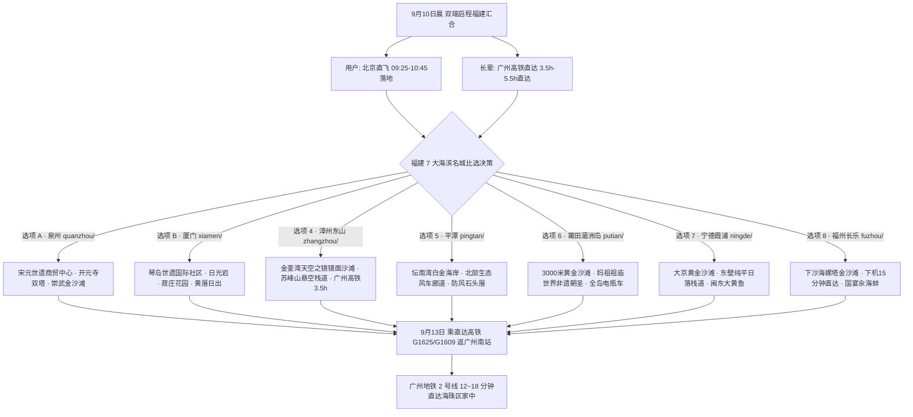

# 2026 福建 4 天 3 晚海丝世遗与东南海岛海滨度假专区总览

> **专案代号**：`fujian`  
> **方案定制机构**：华夏纵横文旅智库旅行社  
> **出行周期**：2026 年 9 月 10 日（周四中午抵离汇合）至 9 月 13 日（周日傍晚返穗）· 4 天 3 晚  
> **【正式锁定目的地】**：**福建莆田湄洲岛 (`putian/`)**（3000米黄金沙滩 · 妈祖世界非遗 · 全岛纯电代步适老度假）  
> **始发枢纽**：北京大兴国际机场 (PKX) 早班直飞泉州晋江 (JJN) + 沈海高速专车接驳  
> **广州长辈高铁枢纽**：广州南站始发直达高铁 **G3809（08:01-13:02，5h01m 零换乘直达莆田站）**  
> **终到闭环**：直达高铁返回广州南站 → 广州地铁 2 号线 12~18 分钟直达海珠区家中圆满闭环  
> **专家联合签发**：总负责人 陆承远 · 规划总监 程若曦 · 特级导游 卫国强 · 历史学者 梁思涵 博士 · 地理学者 顾玄石 博士  
> **合规执行标准**：SOP-GOV-2026-001 内容真实性与商业实体四要素核验标准

---

## 1. 福建专区战略定位与七城/海岛比选格局

福建沿海拥有中国最曲折丰富的海岸线与众多世界级文化遗产海岛。智库团队为贵宾定制了覆盖福建全省 7 大代表性海滨目的地的完整比选矩阵：

---

## 2. 福建全域 7 大海滨方案核心维度对比矩阵

| 对比维度         | 漳州东山岛 (`zhangzhou/`)     | 平潭综合实验区 (`pingtan/`)   | 莆田湄洲岛 (`putian/`)        | 宁德霞浦 (`ningde/`)            | 福州长乐 (`fuzhou/`)            | 泉州世遗 (`quanzhou/`)          | 厦门琴岛 (`xiamen/`)            |
| :--------------- | :---------------------------- | :---------------------------- | :---------------------------- | :------------------------------ | :------------------------------ | :------------------------------ | :------------------------------ |
| **核心海滩**     | **金銮湾** (天空之镜镜面沙滩) | **坛南湾** (白金海岸避风海湾) | **黄金沙滩** (3000米天然金沙) | **大京沙滩** (3000米天然细金沙) | **下沙海滩** (8公里海螺塔金沙)  | **崇武西沙湾** (花岗岩古城金沙) | **黄厝海滩** (环岛路海上日出)   |
| **沙滩适老性**   | ⭐⭐⭐⭐⭐ (平滑如镜水膜)     | ⭐⭐⭐⭐⭐ (白细无礁石)       | ⭐⭐⭐⭐⭐ (坡缓电瓶车代步)   | ⭐⭐⭐⭐☆ (背靠林荫平缓)        | ⭐⭐⭐⭐⭐ (宽阔平展)           | ⭐⭐⭐⭐☆ (石城海防)            | ⭐⭐⭐⭐☆ (平缓漫道)            |
| **长辈广州高铁** | **直达 3h35m** (G1609 至云霄) | **高铁联运 5.5h** (至平潭站)  | **直达 4h38m** (G1609 至莆田) | **直达 6h10m** (G1609 至霞浦)   | **直达 5h20m** (G1609 至福州南) | **直达 4h57m** (G1625 至泉州)   | **直达 4h27m** (G1625 至厦门北) |
| **用户北京直飞** | 飞揭阳 (10:45到) + 专车50m    | 飞福州 (10:20到) + 专车45m    | 飞晋江/福州 + 专车40m         | 飞温州 + 动车35m                | 飞福州 (10:20到) **下机15m**    | 飞晋江 (10:45到)                | 飞厦门 (09:25到)                |
| **特色美食品鉴** | 白灼东山小管、鲜蒸红鲟        | 清蒸平潭红蟳、焖冬粉          | 南日鲍鱼养生宴、妈祖素斋      | 闽东大黄鱼、霞浦剑蛏            | 鸡汤汆海蚌国宴、同利肉燕        | 泉州面线糊、石花膏、姜母鸭      | 临家姜母鸭、南普陀素斋          |
| **推荐住宿标的** | `东山海明威大酒店`            | `平潭宇诚海景国际酒店`        | `湄洲岛安泰清辉大酒店`        | `霞浦晨曦海景大酒店`            | `福州长乐海瀛湾佰翔度假酒店`    | `崇武西沙湾假日酒店`            | `厦门海悦山庄酒店`              |

---

## 3. 子目录导航

- 🏝️ **选项 4 · 漳州东山岛专案**：[`zhangzhou/`](file:///c:/Users/ASUS/Documents/Code/Local/AGENT-PLAYGROUND/travel-agency/plans/2026-09-05-to-09-13/fujian/zhangzhou/)
  - [漳州东山岛 4D3N 全景规划](file:///c:/Users/ASUS/Documents/Code/Local/AGENT-PLAYGROUND/travel-agency/plans/2026-09-05-to-09-13/fujian/zhangzhou/2026-09-10-beijing-to-zhangzhou-4d3n-travel-plan.md) | [交互式 Web 门户](file:///c:/Users/ASUS/Documents/Code/Local/AGENT-PLAYGROUND/travel-agency/plans/2026-09-05-to-09-13/fujian/zhangzhou/index.html)
- 🌊 **选项 5 · 平潭实验区专案**：[`pingtan/`](file:///c:/Users/ASUS/Documents/Code/Local/AGENT-PLAYGROUND/travel-agency/plans/2026-09-05-to-09-13/fujian/pingtan/)
  - [平潭 4D3N 全景规划](file:///c:/Users/ASUS/Documents/Code/Local/AGENT-PLAYGROUND/travel-agency/plans/2026-09-05-to-09-13/fujian/pingtan/2026-09-10-beijing-to-pingtan-4d3n-travel-plan.md) | [交互式 Web 门户](file:///c:/Users/ASUS/Documents/Code/Local/AGENT-PLAYGROUND/travel-agency/plans/2026-09-05-to-09-13/fujian/pingtan/index.html)
- 🏮 **选项 6 · 莆田湄洲岛专案**：[`putian/`](file:///c:/Users/ASUS/Documents/Code/Local/AGENT-PLAYGROUND/travel-agency/plans/2026-09-05-to-09-13/fujian/putian/)
  - [莆田湄洲岛 4D3N 全景规划](file:///c:/Users/ASUS/Documents/Code/Local/AGENT-PLAYGROUND/travel-agency/plans/2026-09-05-to-09-13/fujian/putian/2026-09-10-beijing-to-putian-4d3n-travel-plan.md) | [交互式 Web 门户](file:///c:/Users/ASUS/Documents/Code/Local/AGENT-PLAYGROUND/travel-agency/plans/2026-09-05-to-09-13/fujian/putian/index.html)
- 🌅 **选项 7 · 宁德霞浦专案**：[`ningde/`](file:///c:/Users/ASUS/Documents/Code/Local/AGENT-PLAYGROUND/travel-agency/plans/2026-09-05-to-09-13/fujian/ningde/)
  - [宁德霞浦 4D3N 全景规划](file:///c:/Users/ASUS/Documents/Code/Local/AGENT-PLAYGROUND/travel-agency/plans/2026-09-05-to-09-13/fujian/ningde/2026-09-10-beijing-to-ningde-4d3n-travel-plan.md) | [交互式 Web 门户](file:///c:/Users/ASUS/Documents/Code/Local/AGENT-PLAYGROUND/travel-agency/plans/2026-09-05-to-09-13/fujian/ningde/index.html)
- 🐚 **选项 8 · 福州长乐专案**：[`fuzhou/`](file:///c:/Users/ASUS/Documents/Code/Local/AGENT-PLAYGROUND/travel-agency/plans/2026-09-05-to-09-13/fujian/fuzhou/)
  - [福州长乐 4D3N 全景规划](file:///c:/Users/ASUS/Documents/Code/Local/AGENT-PLAYGROUND/travel-agency/plans/2026-09-05-to-09-13/fujian/fuzhou/2026-09-10-beijing-to-fuzhou-4d3n-travel-plan.md) | [交互式 Web 门户](file:///c:/Users/ASUS/Documents/Code/Local/AGENT-PLAYGROUND/travel-agency/plans/2026-09-05-to-09-13/fujian/fuzhou/index.html)
- 🏛️ **选项 A · 泉州世遗专案**：[`quanzhou/`](file:///c:/Users/ASUS/Documents/Code/Local/AGENT-PLAYGROUND/travel-agency/plans/2026-09-05-to-09-13/fujian/quanzhou/)
- 🎹 **选项 B · 厦门琴岛专案**：[`xiamen/`](file:///c:/Users/ASUS/Documents/Code/Local/AGENT-PLAYGROUND/travel-agency/plans/2026-09-05-to-09-13/fujian/xiamen/)
- 🔙 **返回 9D8N 总目录**：[`../README.md`](file:///c:/Users/ASUS/Documents/Code/Local/AGENT-PLAYGROUND/travel-agency/plans/2026-09-05-to-09-13/README.md)
