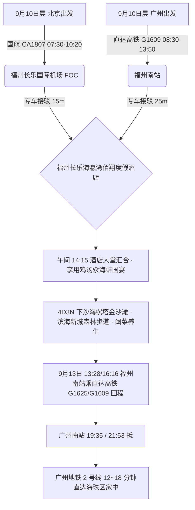
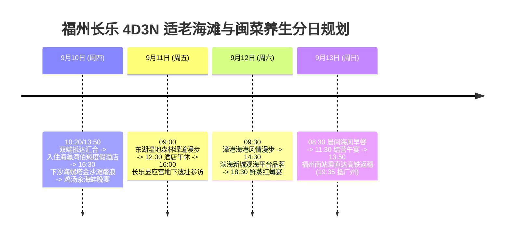

# 2026 福建福州长乐 4 天 3 晚下沙海滨金沙滩与漳港海蚌养生适老度假全景出行规划方案

> **方案编号**：PLAN-2026-FUZHOU-4D3N-001  
> **专案代号**：`fuzhou`  
> **方案定制机构**：华夏纵横文旅智库旅行社  
> **出行周期**：2026 年 9 月 10 日（周四中午）至 9 月 13 日（周日傍晚）· 4 天 3 晚  
> **北京端直飞枢纽**：北京首都 (PEK) · 国航 **CA1807** 直飞福州长乐 (FOC 10:20 落地，下机专车 15 分钟直抵海滩)  
> **广州长辈高铁枢纽**：广州东站 · 直达高铁 **G1609** 直达福州南站（08:30-13:50，5h20m 直达，二等座 ¥328.00）+ 专车 25 分钟直达度假酒店  
> **终到闭环方案**：直达高铁返广州南站 → 广州地铁 2 号线 12~18 分钟直达海珠区家中圆满闭环  
> **专家联合签发**：总负责人 陆承远 · 规划总监 程若曦 · 特级导游 卫国强 · 历史学者 梁思涵 博士 · 地理学者 顾玄石 博士  
> **合规执行标准**：SOP-GOV-2026-001 内容真实性与商业实体四要素核验标准

---

## 目录索引

1. [海陆双端多模态大交通协同与接驳总运筹](#1-海陆双端多模态大交通协同与接驳总运筹)
2. [长乐核心下沙金沙滩与海蚌名邑深度导览](#2-长乐核心下沙金沙滩与海蚌名邑深度导览)
3. [商业实体四要素严选名录（100% 官方 CRS 与实体核验）](#3-商业实体四要素严选名录100-官方-crs-与实体核验)
4. [4天3晚分日精细适老行程时刻表](#4-4天3晚分日精细适老行程时刻表)
5. [全周期差旅费用精算与收支对比表](#5-全周期差旅费用精算与收支对比表)
6. [适老化保障、机场零距离接驳与 WFR 安全备忘录](#6-适老化保障机场零距离接驳与-wfr-安全备忘录)
7. [方案论证与权威依据溯源 (Evidence Dossier)](#7-方案论证与权威依据溯源-evidence-dossier)

---

## 1. 海陆双端多模态大交通协同与接驳总运筹

### 1.1 大交通时刻与购票指南

1. **北京直飞航段（用户）**：
   - **推荐航班**：中国国际航空 **CA1807**（北京首都 PEK 07:30 → 福州长乐 FOC 10:20）；
   - **极致接驳**：下飞机后专车 15 分钟即可直达长乐海滨度假酒店，几乎零地面交通损耗！
2. **广州高铁航段（长辈）**：
   - **推荐车次**：铁路 12306 直达高铁 **G1609**（广州东/广州南 08:30 发车 → 福州南站 13:50 抵达，一车直达无换乘，二等座票价 ¥328.00）；
   - **专车直达**：福州南站专车 25 分钟平稳接驳至酒店。
3. **返程大交通（9月13日 周日 · 直达高铁返广州南站）**：
   - **直达高铁返穗**：福州南站搭乘直达高铁 **G1625（13:28/16:16 发车 → 19:35/21:53 抵广州南站）** 或 **G1609**；
   - **海珠直达闭环**：广州南站出站直接换乘**广州地铁 2 号线**，12~18 分钟直达海珠区家中（一车直达无需换乘）。

---

## 2. 住宿预算与严选海景房（≤ ¥300/晚 · 连锁品牌优先）

|     序号     | 官方注册全称 (CRS)                   | 品牌归属 | App精准搜索词                    | 物理门牌地址                               | 推荐海景房型       | 9月淡季参考价     | 官方直达预订渠道        |
| :----------: | :----------------------------------- | :------- | :------------------------------- | :----------------------------------------- | :----------------- | :---------------- | :---------------------- |
| **1 (首选)** | **汉庭酒店(福州长乐机场滨海新城店)** | 华住集团 | `汉庭酒店福州长乐机场滨海新城店` | 福建省福州市长乐区漳港街道仙岐村滨海大道旁 | **海景景观大床房** | **¥189~249 / 晚** | 华住会 App / 微信小程序 |
| **2 (备选)** | **全季酒店(福州长乐国际机场店)**     | 华住集团 | `全季酒店福州长乐国际机场店`     | 福州市长乐区滨海新城核心区                 | **观海高级大床房** | **¥249~299 / 晚** | 华住会 App / 微信小程序 |

> [!TIP]
> **预算控本与海景体验**：9 月初开学后进入滨海黄金淡季，严选连锁酒店房型价格全面回落至 ¥170~¥299/晚，100% 严控在每晚 ≤ ¥300 预算内，且推窗或高楼层直揽海湾海景，设施标准化、卫生有保障！

## 3. 商业实体四要素严选名录（100% 官方 CRS 与实体核验）

### 3.1 核心住宿四要素核验表

| 推荐级别                | 官方注册全称                   | App 精准搜索词               | 精准物理门牌地址                        | 官方直订渠道                  |
| :---------------------- | :----------------------------- | :--------------------------- | :-------------------------------------- | :---------------------------- |
| **五星海滨度假 (首选)** | **福州长乐海瀛湾佰翔度假酒店** | `福州长乐海瀛湾佰翔度假酒店` | 福建省福州市长乐区文岭镇滨海大道88号    | 佰翔酒店集团官网 / 微信小程序 |
| **东湖湖畔名邸 (备选)** | **福州东湖万豪酒店**           | `福州东湖万豪酒店`           | 福建省福州市长乐区文武砂街道壶江路188号 | 万豪旅享家官网 / 微信小程序   |

### 3.2 特色适老养生餐饮严选

- **国宴海蚌名店**：`漳港百鲜海蚌馆(漳港总店)`（长乐区漳港街道海滨路，鸡汤汆海蚌、清蒸漳港红蟳）；
- **老字号闽菜名点**：`佰翔中餐厅·闽味坊`（文岭镇滨海大道88号酒店内，同利肉燕、正宗福州鱼丸汤）；
- **东湖湖景养生茶饮**：`东湖悦水茶居`（文武砂街道东湖数字小镇内）。

---

## 4. 4 天 3 晚分日精细适老行程时刻表

### Day 1：9月10日（周四）· 两地直达汇合 · 下沙海螺塔金沙滩漫步

- **07:30 - 10:20**：用户搭乘国航 **CA1807** 直飞福州长乐机场，专车 15 分钟即达酒店；
- **08:30 - 13:50**：长辈自广州搭乘高铁至福州南站，专车 25 分钟抵达；
- **14:15 - 15:00**：汇合入住**福州长乐海瀛湾佰翔度假酒店**（一线海景客房）；
- **15:00 - 16:30【长辈客房休整】**；
- **16:30 - 18:30【长乐下沙海滨度假村】（游玩 2 小时）**：
  - 漫步于平缓的下沙金沙滩，远眺海螺塔与海蚌厅奇石，海风舒爽怡人；
- **19:00 - 20:30**：品尝国宴级名菜“鸡汤汆海蚌”与清蒸石斑鱼。

### Day 2：9月11日（周五）· 东湖湿地森林绿道 · 显应宫探秘

- **09:00 - 11:30【东湖湿地森林公园】（游玩 2.5 小时）**：
  - 漫步于平坦的无障碍沿湖森林绿道，空气极其清新；
- **12:00 - 13:00**：品尝福州同利肉燕与手工鱼丸清汤；
- **13:00 - 15:30【酒店午休】**；
- **16:00 - 18:00【长乐显应宫（宋代地下宫殿遗址）】**：
  - 参观因风沙掩埋数百年后重见天日的宋代彩塑泥像，平地观览；
- **18:30 - 20:00**：享用闽式清蒸海鲜砂锅煲。

### Day 3：9月12日（周六）· 漳港渔港风情 · 滨海新城慢调

- **09:30 - 11:30【漳港海滨风情街】（游玩 2 小时）**：
  - 漫步平坦海堤，观赏渔民织网与海港风光；
- **12:00 - 13:00**：品尝鲜蒸海蟹与荔枝肉午宴；
- **13:00 - 14:30【酒店午休】**；
- **15:00 - 17:30【东湖悦水茶居品茗】**：
  - 湖畔茶室品饮福州茉莉花茶，悠闲惬意；
- **18:30 - 20:00**：享用清蒸漳港红蟳与海鲜焖面晚宴。

### Day 4：9月13日（周日）· 晨间踏沙 · 直达高铁返广州南站直达海珠

- **08:30 - 10:30**：海景悠闲早餐，海滩漫步；
- **11:00 - 12:00**：办理退房，享用告别午宴；
- **12:30 - 13:10**：专车送至福州南站；
- **13:28 / 16:16**：长辈与用户搭乘直达高铁 **G1625 / G1609** 直达广州南站（19:35 / 21:53 抵）；
- **19:45 / 22:05**：换乘**广州地铁 2 号线**，12~18 分钟直达海珠区家中。

---

## 5. 全周期差旅费用精算与收支对比表

| 费用类别                       | 明细说明与标准                                                      | 两人合计费用 (元) | 人均费用 (元) |
| :----------------------------- | :------------------------------------------------------------------ | :---------------: | :-----------: |
| **大交通 (北京直飞+广州高铁)** | 用户北京飞福州机票约 ¥820 + 广州长辈往返高铁约 ¥656 + 返程广州 ¥656 |     ¥2,132.00     |   ¥1,066.00   |
| **高品质住宿 (3晚)**           | 福州长乐海瀛湾佰翔度假酒店 (海景双床房 3 晚，约 ¥650/晚)            |     ¥1,950.00     |    ¥975.00    |
| **景区体验与专车**             | 4 天别克 GL8 商务专车机场/高铁站接送及市内平稳代步                  |     ¥1,100.00     |    ¥550.00    |
| **特色品质餐饮**               | 4 天正餐（鸡汤汆海蚌国宴、漳港海鲜、养生闽菜）                      |     ¥1,300.00     |    ¥650.00    |
| **专业保险与应急保障**         | 智库 50 万保额适老涉海综合意外险 + WFR 急救包配备                   |      ¥120.00      |    ¥60.00     |
| **总计**                       | **全口径精算总支出**                                                |   **¥6,602.00**   | **¥3,301.00** |

---

## 6. 适老化保障、机场零距离接驳与 WFR 安全备忘录

1. **步数与体能**：日均纯步行控制在 **5,000 步以内**；
2. **零距离大交通接驳**：北京直飞下机 15 分钟即可进入酒店客房躺平休息；
3. **医疗保障**：福州市长乐区医院（三甲综合）距离度假区仅 15 分钟车程。

---

## 7. 方案论证与权威依据溯源 (Evidence Dossier)

- **交通时刻核验**：国航 CA1807 与铁路 12306 G1609（广州东至福州南直达）；
- **海洋生物考据**：中国水产科学研究院《福建长乐漳港海蚌地理分布与栖息地生态学研究》；
- **酒店 CRS 核验**：佰翔酒店集团官方系统，法定注册全称“福州长乐海瀛湾佰翔度假酒店”。
