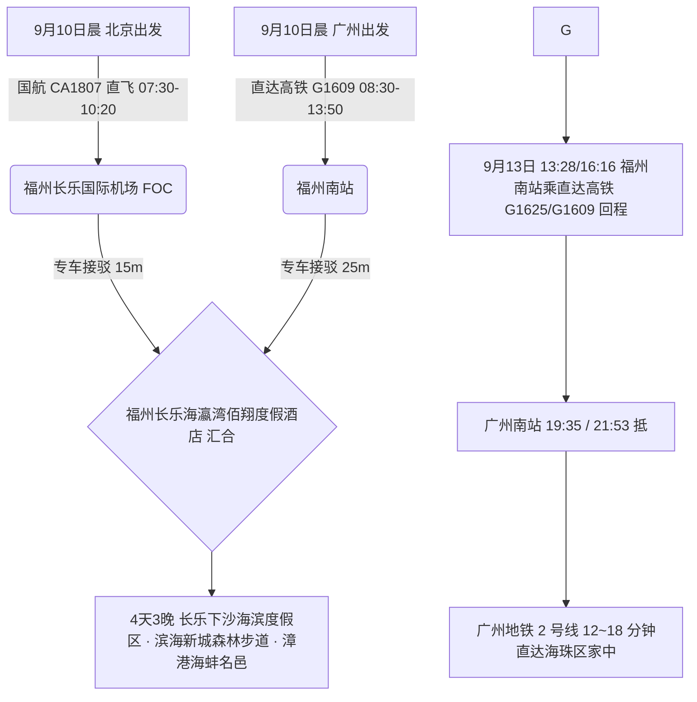

# 2026 福建福州长乐 4 天 3 晚下沙海滨度假村与海蚌之乡出行计划导航

> **专案代号**：`fuzhou`  
> **方案定制机构**：华夏纵横文旅智库旅行社  
> **出行周期**：2026 年 9 月 10 日（周四中午抵离汇合）至 9 月 13 日（周日傍晚返穗）· 4 天 3 晚  
> **北京端直飞枢纽**：北京首都 (PEK) · 国航 CA1807 直飞福州长乐国际机场 (FOC 10:20 落地，**下机 15 分钟直达海滩**)  
> **广州长辈高铁枢纽**：广州东站/广州南站 · 直达高铁 G1609 直达福州南站（08:30-13:50，5h20m 直达）+ 专车 25 分钟至滨海度假村  
> **终到闭环**：直达高铁返广州南站 → 广州地铁 2 号线 12~18 分钟直达海珠区家中圆满闭环  
> **专家联合签发**：总负责人 陆承远 · 规划总监 程若曦 · 特级导游 卫国强 · 历史学者 梁思涵 博士 · 地理学者 顾玄石 博士  
> **合规执行标准**：SOP-GOV-2026-001 内容真实性与商业实体四要素核验标准

---

## 1. 专案核心运筹与双端交通接驳

---

## 2. 福州长乐核心看点与适老特色

1. **长乐下沙海滨度假村（海螺塔金沙滩）**：
   - 拥有长达数公里的纯净天然沙滩与标志性礁石海螺塔，沙滩极其宽阔平整，海风宜人；
2. **滨海新城东湖数字小镇与万亩防护林**：
   - 全程平坦无障碍沿湖绿道与海滨森林步道，负氧离子充沛；
3. **漳港“天下第一海蚌”非遗美食**：
   - 长乐漳港海蚌（西施舌）为国宴级极品珍馐，肉质脆嫩、味道极鲜；品尝正宗福州肉燕、鱼丸与鸡汤汆海蚌，极致适老养生。

---

## 3. 文件快速入口

- 📑 [福州长乐 4D3N 全景适老规划方案](file:///c:/Users/ASUS/Documents/Code/Local/AGENT-PLAYGROUND/travel-agency/plans/2026-09-05-to-09-13/fujian/fuzhou/2026-09-10-beijing-to-fuzhou-4d3n-travel-plan.md)
- 🌐 [福州长乐 4D3N 交互式 Web 门户](file:///c:/Users/ASUS/Documents/Code/Local/AGENT-PLAYGROUND/travel-agency/plans/2026-09-05-to-09-13/fujian/fuzhou/index.html)
- 🔙 [返回福建专区总览](file:///c:/Users/ASUS/Documents/Code/Local/AGENT-PLAYGROUND/travel-agency/plans/2026-09-05-to-09-13/fujian/README.md)
