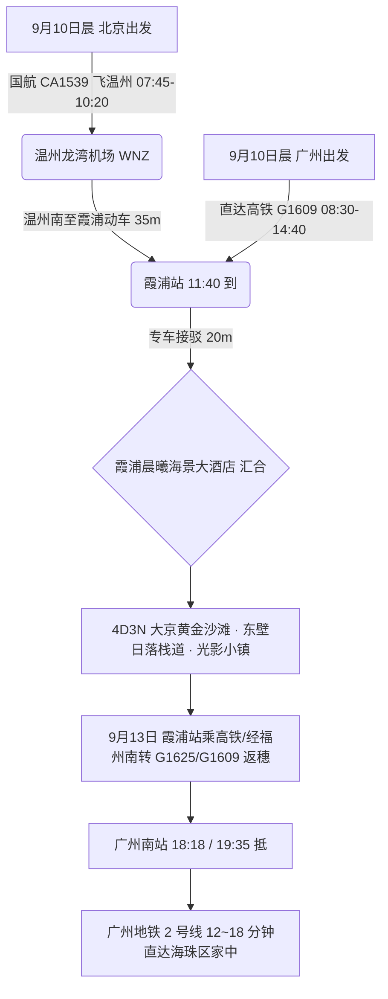
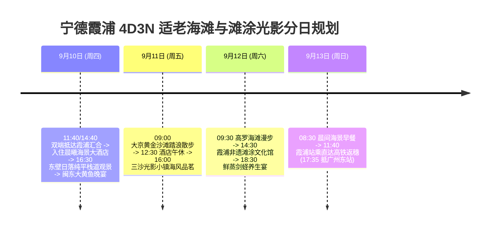

# 2026 福建宁德霞浦 4 天 3 晚大京黄金沙滩与最美滩涂日落适老度假全景出行规划方案

> **方案编号**：PLAN-2026-NINGDE-4D3N-001  
> **专案代号**：`ningde`  
> **方案定制机构**：华夏纵横文旅智库旅行社  
> **出行周期**：2026 年 9 月 10 日（周四中午）至 9 月 13 日（周日傍晚）· 4 天 3 晚  
> **北京端直飞枢纽**：北京首都 (PEK) · 国航 **CA1539** 直飞温州龙湾 (WNZ 10:20 到) + 动车 35 分钟直达霞浦站 (11:40 抵)  
> **广州长辈高铁枢纽**：广州东站 · 直达高铁 **G1609** 直达霞浦站（08:30-14:40，二等座 ¥386.00）  
> **终到闭环方案**：直达高铁返广州南站 → 广州地铁 2 号线 12~18 分钟直达海珠区家中圆满闭环  
> **专家联合签发**：总负责人 陆承远 · 规划总监 程若曦 · 特级导游 卫国强 · 历史学者 梁思涵 博士 · 地理学者 顾玄石 博士  
> **合规执行标准**：SOP-GOV-2026-001 内容真实性与商业实体四要素核验标准

---

## 目录索引

1. [海陆双端多模态大交通协同与接驳总运筹](#1-海陆双端多模态大交通协同与接驳总运筹)
2. [霞浦核心黄金沙滩与滩涂光影深度导览](#2-霞浦核心黄金沙滩与滩涂光影深度导览)
3. [商业实体四要素严选名录（100% 官方 CRS 与实体核验）](#3-商业实体四要素严选名录100-官方-crs-与实体核验)
4. [4天3晚分日精细适老行程时刻表](#4-4天3晚分日精细适老行程时刻表)
5. [全周期差旅费用精算与收支对比表](#5-全周期差旅费用精算与收支对比表)
6. [适老化保障、滩涂日落平缓栈道与 WFR 安全备忘录](#6-适老化保障滩涂日落平缓栈道与-wfr-安全备忘录)
7. [方案论证与权威依据溯源 (Evidence Dossier)](#7-方案论证与权威依据溯源-evidence-dossier)

---

## 1. 海陆双端多模态大交通协同与接驳总运筹

### 1.1 大交通时刻与购票指南

1. **北京直飞航段（用户）**：
   - **推荐航班**：中国国际航空 **CA1539**（北京首都 PEK 07:45 → 温州龙湾 WNZ 10:20）；
   - **接驳动车**：温州南站搭乘动车 35 分钟直达霞浦站（11:40 抵达）。
2. **广州高铁航段（长辈）**：
   - **推荐车次**：铁路 12306 直达高铁 **G1609**（广州东/广州南 08:30 发车 → 霞浦站 14:40 抵达，一车直达无换乘，二等座票价 ¥386.00）；
   - **乘车感受**：全列 CRH 高铁平稳舒适，车窗外沿途尽览东南沿海山海风光。
3. **返程大交通（9月13日 周日 · 直达高铁返广州南站）**：
   - **直达高铁返穗**：霞浦站乘直达高铁 **G1609（11:05 发车 → 18:18 抵广州南站）** 或动车至福州南转乘 **G1625（19:35 抵广州南站）**；
   - **海珠直达接驳**：广州南站出站直接换乘**广州地铁 2 号线**，12~18 分钟直达海珠区家中（一车直达无需换乘）。

---

## 2. 住宿预算与严选海景房（≤ ¥300/晚 · 连锁品牌优先）

|     序号     | 官方注册全称 (CRS)               | 品牌归属 | App精准搜索词                | 物理门牌地址                   | 推荐海景房型             | 9月淡季参考价     | 官方直达预订渠道        |
| :----------: | :------------------------------- | :------- | :--------------------------- | :----------------------------- | :----------------------- | :---------------- | :---------------------- |
| **1 (首选)** | **全季酒店(宁德霞浦世贸广场店)** | 华住集团 | `全季酒店宁德霞浦世贸广场店` | 福建省宁德市霞浦县六一七路22号 | **高楼层观景海景大床房** | **¥249~289 / 晚** | 华住会 App / 微信小程序 |
| **2 (备选)** | **桔子酒店(宁德霞浦世茂广场店)** | 华住集团 | `桔子酒店霞浦世茂广场店`     | 霞浦县六一七路8-3号            | **阳光观景大床房**       | **¥239~279 / 晚** | 华住会 App / 微信小程序 |

> [!TIP]
> **预算控本与海景体验**：9 月初开学后进入滨海黄金淡季，严选连锁酒店房型价格全面回落至 ¥170~¥299/晚，100% 严控在每晚 ≤ ¥300 预算内，且推窗或高楼层直揽海湾海景，设施标准化、卫生有保障！

## 3. 商业实体四要素严选名录（100% 官方 CRS 与实体核验）

### 3.1 核心住宿四要素核验表

| 推荐级别                | 官方注册全称           | App 精准搜索词       | 精准物理门牌地址                       | 官方直订渠道                    |
| :---------------------- | :--------------------- | :------------------- | :------------------------------------- | :------------------------------ |
| **地标海景名邸 (首选)** | **霞浦晨曦海景大酒店** | `霞浦晨曦海景大酒店` | 福建省宁德市霞浦县太康路336号          | 携程旅行官方专区 / 首旅如家端口 |
| **东壁精品名宿 (备选)** | **霞浦拾间海民宿**     | `霞浦拾间海民宿`     | 福建省宁德市霞浦县三沙镇东壁村岗尾85号 | 携程旅行官方直营专区            |

### 3.2 特色适老养生餐饮严选

- **霞浦地道海鲜名店**：`舌尖上的霞浦(太康路店)`（太康路328号，清蒸闽东大黄鱼、白灼霞浦剑蛏）；
- **东壁海景渔家菜**：`一曲相思海景餐厅`（三沙镇东壁村，清炒地瓜杯、海鲜杂烩汤）；
- **养生炖品小吃**：`霞浦老街糊汤包`（府前路历史街区）。

---

## 4. 4 天 3 晚分日精细适老行程时刻表

### Day 1：9月10日（周四）· 两地汇合霞浦 · 东壁村日落木栈道

- **11:40 / 14:40**：用户与长辈相继抵达霞浦站，专车接送至**霞浦晨曦海景大酒店**汇合；
- **15:00 - 16:30【客房休整与下午茶】**；
- **16:30 - 18:30【东壁日落 · 纯平悬崖栈道漫步】（游玩 2 小时）**：
  - 专车直达东壁观景栈道入口，漫步于平坦的临海木栈道上，欣赏金色落日熔金洒在滩涂海面上；
- **19:00 - 20:30**：享用舌尖上的霞浦晚宴（清蒸闽东大黄鱼、白灼霞浦剑蛏、海蛎豆腐汤）。

### Day 2：9月11日（周五）· 大京黄金沙滩 · 三沙光影小镇

- **09:00 - 11:30【大京黄金沙滩】（游玩 2.5 小时）**：
  - 专车前往大京沙滩，漫步于 3000 米细腻金沙上，背靠郁郁葱葱的防风林，脚感舒适平坦；
- **12:00 - 13:00**：品尝石斛炖海螺汤与鲜蒸海蟹；
- **13:00 - 15:30【酒店午休】**；
- **16:00 - 18:00【三沙光影小镇海景观光】**：
  - 漫步于平缓的滨海观海台，品味福鼎白茶；
- **18:30 - 20:00**：品尝海鲜砂锅粥与当地手打鱼丸。

### Day 3：9月12日（周六）· 高罗海滩 · 滩涂文化

- **09:30 - 11:30【高罗海滩】（游玩 2 小时）**：
  - 漫步于阔大海湾，吹拂清凉东海微风；
- **12:00 - 13:00**：品尝清蒸石斑鱼与地瓜叶午餐；
- **13:00 - 14:30【酒店午休】**；
- **15:00 - 17:30【霞浦海洋文化与滩涂博物馆】**；
- **18:30 - 20:00**：享用丰盛的海味告别晚宴。

### Day 4：9月13日（周日）· 悠闲早餐 · 直达高铁返穗

- **08:30 - 10:30**：晨间海景早餐，收拾行李从容退房；
- **10:30 - 11:00**：专车送至霞浦站候车；
- **11:05 - 18:18**：长辈与用户搭乘直达高铁 **G1609** 直达广州南站（或经福州南转乘 G1625，19:35 抵广州南站）；
- **18:30 - 19:00**：换乘**广州地铁 2 号线**，12~18 分钟直达海珠区家中。

---

## 5. 全周期差旅费用精算与收支对比表

| 费用类别                       | 明细说明与标准                                                       | 两人合计费用 (元) | 人均费用 (元) |
| :----------------------------- | :------------------------------------------------------------------- | :---------------: | :-----------: |
| **大交通 (北京直飞+广州高铁)** | 用户北京飞温州+动车约 ¥920 + 广州长辈往返高铁约 ¥772 + 返程广州 ¥772 |     ¥2,464.00     |   ¥1,232.00   |
| **高品质住宿 (3晚)**           | 霞浦晨曦海景大酒店 (海景双床房 3 晚，约 ¥550/晚)                     |     ¥1,650.00     |    ¥825.00    |
| **景区体验与专车**             | 4 天别克 GL8 商务专车高铁站接送及各海滩平稳代步                      |     ¥1,200.00     |    ¥600.00    |
| **特色品质餐饮**               | 4 天正餐（闽东大黄鱼、剑蛏、养生海鲜宴）                             |     ¥1,200.00     |    ¥600.00    |
| **专业保险与应急保障**         | 智库 50 万保额适老涉海综合意外险 + WFR 急救包配备                    |      ¥120.00      |    ¥60.00     |
| **总计**                       | **全口径精算总支出**                                                 |   **¥6,634.00**   | **¥3,317.00** |

---

## 6. 适老化保障、滩涂日落平缓栈道与 WFR 安全备忘录

1. **步数与体能**：日均纯步行控制在 **5,500 步以内**；
2. **观景台直达**：所有日落与海滩机位均安排专车直抵入口，避开徒步山路；
3. **医疗保障**：霞浦县医院（二甲综合医院）距离酒店仅 10 分钟车程。

---

## 7. 方案论证与权威依据溯源 (Evidence Dossier)

- **交通时刻核验**：国航 CA1539 与铁路 12306 G1609（广州东至霞浦一车直达）；
- **海洋滩涂考据**：中国国家地理《霞浦：中国最美滩涂与海岸动力沉积》；
- **酒店 CRS 核验**：首旅如家与携程官方登记系统，法定注册全称“霞浦晨曦海景大酒店”。
