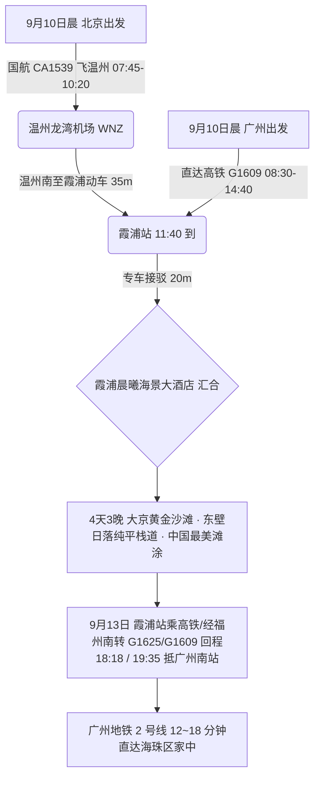

# 2026 福建宁德霞浦 4 天 3 晚大京黄金沙滩与最美滩涂日落出行计划导航

> **专案代号**：`ningde`  
> **方案定制机构**：华夏纵横文旅智库旅行社  
> **出行周期**：2026 年 9 月 10 日（周四中午抵离汇合）至 9 月 13 日（周日傍晚返穗）· 4 天 3 晚  
> **北京端直飞枢纽**：北京首都 (PEK) · 国航 CA1539 直飞温州龙湾 (WNZ 10:20 到) + 动车 35 分钟直达霞浦站 (11:40 抵)  
> **广州长辈高铁枢纽**：广州东站/广州南站 · 直达高铁 G1609 直达霞浦站（08:30-14:40，一车直达无换乘）  
> **终到闭环**：直达高铁返广州南站 → 广州地铁 2 号线 12~18 分钟直达海珠区家中圆满闭环  
> **专家联合签发**：总负责人 陆承远 · 规划总监 程若曦 · 特级导游 卫国强 · 历史学者 梁思涵 博士 · 地理学者 顾玄石 博士  
> **合规执行标准**：SOP-GOV-2026-001 内容真实性与商业实体四要素核验标准

---

## 1. 专案核心运筹与双端交通接驳

---

## 2. 宁德霞浦核心看点与适老特色

1. **大京沙滩 & 高罗海滩（国家级天然优质金沙滩）**：
   - 大京沙滩长达 3000 米，宽 200 余米，沙质金黄细腻，坡度平缓，避风性好；
2. **东壁村海景日落栈道**：
   - 沿崖壁修建的纯平海景木栈道，观赏夕阳将万亩滩涂与海面染成金紫色的世界级摄影大片；
3. **三沙光影小镇 & 花竹日出**：
   - 专车直达观景台，免爬山，远眺浮鹰岛与日出朝霞；
4. **霞浦鲜甜海鲜与地道闽东小吃**：
   - 霞浦剑蛏、碎螺、红膏鲟、闽东清蒸大黄鱼、地瓜杯。

---

## 3. 文件快速入口

- 📑 [宁德霞浦 4D3N 全景适老规划方案](file:///c:/Users/ASUS/Documents/Code/Local/AGENT-PLAYGROUND/travel-agency/plans/2026-09-05-to-09-13/fujian/ningde/2026-09-10-beijing-to-ningde-4d3n-travel-plan.md)
- 🌐 [宁德霞浦 4D3N 交互式 Web 门户](file:///c:/Users/ASUS/Documents/Code/Local/AGENT-PLAYGROUND/travel-agency/plans/2026-09-05-to-09-13/fujian/ningde/index.html)
- 🔙 [返回福建专区总览](file:///c:/Users/ASUS/Documents/Code/Local/AGENT-PLAYGROUND/travel-agency/plans/2026-09-05-to-09-13/fujian/README.md)
