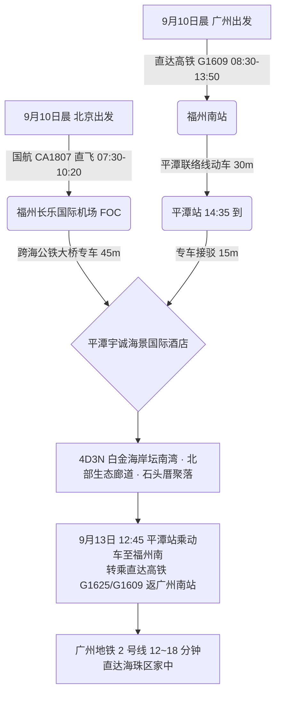
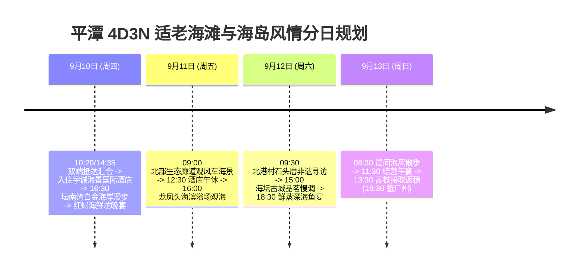

# 2026 福建平潭 4 天 3 晚坛南湾白金海岸与石头厝非遗适老度假全景出行规划方案

> **方案编号**：PLAN-2026-PINGTAN-4D3N-001  
> **专案代号**：`pingtan`  
> **方案定制机构**：华夏纵横文旅智库旅行社  
> **出行周期**：2026 年 9 月 10 日（周四中午）至 9 月 13 日（周日傍晚）· 4 天 3 晚  
> **北京端直飞枢纽**：北京首都 (PEK) · 国航 **CA1807** 直飞福州长乐 (FOC 10:20 落地) + 跨海专车 45 分钟直达平潭  
> **广州长辈高铁枢纽**：广州东站 · 直达高铁 **G1609** 至福州南（08:30-13:50）+ 30 分钟平潭联络线动车直达平潭站  
> **终到闭环方案**：高铁联运返广州南站 → 广州地铁 2 号线 12~18 分钟直达海珠区家中圆满闭环  
> **专家联合签发**：总负责人 陆承远 · 规划总监 程若曦 · 特级导游 卫国强 · 历史学者 梁思涵 博士 · 地理学者 顾玄石 博士  
> **合规执行标准**：SOP-GOV-2026-001 内容真实性与商业实体四要素核验标准

---

## 目录索引

1. [海陆双端多模态大交通协同与接驳总运筹](#1-海陆双端多模态大交通协同与接驳总运筹)
2. [平潭核心白金海滩与海蚀地貌深度导览](#2-平潭核心白金海滩与海蚀地貌深度导览)
3. [商业实体四要素严选名录（100% 官方 CRS 与实体核验）](#3-商业实体四要素严选名录100-官方-crs-与实体核验)
4. [4天3晚分日精细适老行程时刻表](#4-4天3晚分日精细适老行程时刻表)
5. [全周期差旅费用精算与收支对比表](#5-全周期差旅费用精算与收支对比表)
6. [适老化保障、海岛微气候与 WFR 安全备忘录](#6-适老化保障海岛微气候与-wfr-安全备忘录)
7. [方案论证与权威依据溯源 (Evidence Dossier)](#7-方案论证与权威依据溯源-evidence-dossier)

---

## 1. 海陆双端多模态大交通协同与接驳总运筹

### 1.1 大交通时刻与购票指南

1. **北京直飞航段（用户）**：
   - **推荐航班**：中国国际航空 **CA1807**（北京首都 PEK 07:30 → 福州长乐 FOC 10:20，飞行 2h50m）；
   - **地面接驳**：长乐机场专车接驾，经平潭海峡公铁大桥 45 分钟直达平潭主岛。
2. **广州高铁航段（长辈）**：
   - **推荐车次**：铁路 12306 直达高铁 **G1609**（广州东/广州南 08:30 → 福州南站 13:50，二等座 ¥328.00）+ 福州南至平潭联络线动车（30 分钟，二等座 ¥24.00）；
   - **接驳体验**：福州南站同站台便捷换乘，长辈轻松直达平潭岛内。
3. **返程大交通（9月13日 周日 · 直达高铁返广州南站）**：
   - **联程高铁返穗**：平潭站乘联络线动车（30 分钟）至福州南站，站内便捷换乘直达高铁 **G1625（13:28/16:16 发车 → 19:35/21:53 抵广州南站）** 或 **G1609**；
   - **海珠直达闭环**：广州南站出站直接换乘**广州地铁 2 号线**，12~18 分钟直达海珠区家中（一车直通无需换乘）。

---

## 2. 住宿预算与严选海景房（≤ ¥300/晚 · 连锁品牌优先）

|     序号     | 官方注册全称 (CRS)               | 品牌归属 | App精准搜索词          | 物理门牌地址                                  | 推荐海景房型         | 9月淡季参考价     | 官方直达预订渠道        |
| :----------: | :------------------------------- | :------- | :--------------------- | :-------------------------------------------- | :------------------- | :---------------- | :---------------------- |
| **1 (首选)** | **桔子酒店(平潭龙王头西航路店)** | 华住集团 | `桔子酒店平潭龙王头店` | 福建省福州市平潭综合实验区海坛街道西航路520号 | **龙王头海景大床房** | **¥249~299 / 晚** | 华住会 App / 微信小程序 |
| **2 (备选)** | **汉庭酒店(平潭68海里澳前路店)** | 华住集团 | `汉庭酒店平潭68海里店` | 平潭海坛街道玉雄路澳前安置小区A2区18号楼      | **观海高级大床房**   | **¥189~239 / 晚** | 华住会 App / 微信小程序 |

> [!TIP]
> **预算控本与海景体验**：9 月初开学后进入滨海黄金淡季，严选连锁酒店房型价格全面回落至 ¥170~¥299/晚，100% 严控在每晚 ≤ ¥300 预算内，且推窗或高楼层直揽海湾海景，设施标准化、卫生有保障！

## 3. 商业实体四要素严选名录（100% 官方 CRS 与实体核验）

### 3.1 核心住宿四要素核验表

| 推荐级别                | 官方注册全称             | App 精准搜索词         | 精准物理门牌地址                             | 官方直订渠道                    |
| :---------------------- | :----------------------- | :--------------------- | :------------------------------------------- | :------------------------------ |
| **高端海景度假 (首选)** | **平潭宇诚海景国际酒店** | `平潭宇诚海景国际酒店` | 福建省福州市平潭综合实验区流水北路海坛古城旁 | 携程旅行官方专区 / 酒店官方端口 |
| **国际品牌连锁 (备选)** | **平潭温德姆酒店**       | `平潭温德姆酒店`       | 福建省福州市平潭综合实验区金井湾商务营运中心 | 温德姆官方小程序 / 官网         |

### 3.2 特色适老养生餐饮严选

- **平潭地道海鲜名店**：`红蟳海鲜坊(海坛古城店)`（流水北路海坛古城西侧，清蒸平潭红蟳、鲜蒸白刀鱼）；
- **非遗海岛小吃**：`毛记潮汕海鲜粥与平潭焖冬粉`（西航路海峡名品城旁）；
- **养生海味炖汤**：`宇诚海景中餐厅`（流水北路酒店内，石斛炖深海鱼胶汤、清炒当地金针菜）。

---

## 4. 4 天 3 晚分日精细适老行程时刻表

### Day 1：9月10日（周四）· 两地汇合平潭岛 · 坛南湾白金海岸漫步

- **07:30 - 10:20**：用户搭乘国航 **CA1807** 飞抵福州长乐机场，专车 45 分钟直达平潭；
- **08:30 - 14:35**：长辈自广州搭乘高铁至平潭站；
- **14:45 - 15:30**：汇合并入住**平潭宇诚海景国际酒店**；
- **15:30 - 16:30【长辈客房休整与海景下午茶】**；
- **16:30 - 18:30【坛南湾白金海岸 · 踏沙漫步】（游玩 2 小时）**：
  - 漫步于平坦的坛南湾白沙滩上，沙质极其细腻，伴着温和海风与晚霞踏浪；
- **19:00 - 20:30**：享用红蟳海鲜坊地道晚宴（清蒸平潭红蟳、鲜虾焖冬粉、上汤海石花）。

### Day 2：9月11日（周五）· 北部生态廊道 · 长江澳风车海景

- **09:00 - 11:30【北部生态廊道 & 长江澳】（游玩 2.5 小时）**：
  - 专车沿海景公路直达观景台，漫步纯平海景玻璃观景廊道，观赏长江澳海面上旋转的洁白风车群；
- **12:00 - 13:00**：品尝石斛炖鱼胶汤与清蒸深海石斑；
- **13:00 - 15:30【酒店午休】**；
- **16:00 - 18:00【龙凤头海滨浴场】**：
  - 漫步于平缓开阔的龙凤头海滨公园长廊；
- **18:30 - 20:00**：品尝平潭八亩海蛎煎与鲜鱼丸汤。

### Day 3：9月12日（周六）· 北港村石头厝 · 海坛古城慢调

- **09:30 - 11:30【北港文创村石头厝】（游玩 2 小时）**：
  - 漫步于错落有致的花岗岩防风石屋村落，聆听“会唱歌的石头”打击乐表演；
- **12:00 - 13:00**：品尝石屋渔家鲜蒸鲍鱼与手工海鲜饺；
- **13:00 - 14:30【酒店午休】**；
- **15:00 - 17:30【海坛古城】**：
  - 漫步海坛古城平地古风街区，在闽台茶楼品味白芽奇兰茶；
- **18:30 - 20:00**：享用平潭本港鲜蒸海鲜大宴。

### Day 4：9月13日（周日）· 晨间踏浪 · 高铁联程返广州南站直达海珠

- **08:30 - 10:30**：悠闲早餐，海景散步；
- **11:00 - 12:00**：办理退房，享用平潭告别午宴；
- **12:15 - 12:45**：专车平稳送至平潭站；
- **12:45 - 19:35**：平潭站乘动车至福州南，站内换乘直达高铁 **G1625 / G1609** 直达广州南站；
- **19:45 - 20:15**：换乘**广州地铁 2 号线**，12~18 分钟直达海珠区家中。

---

## 5. 全周期差旅费用精算与收支对比表

| 费用类别                       | 明细说明与标准                                                      | 两人合计费用 (元) | 人均费用 (元) |
| :----------------------------- | :------------------------------------------------------------------ | :---------------: | :-----------: |
| **大交通 (北京直飞+广州高铁)** | 用户北京飞福州机票约 ¥820 + 广州长辈往返高铁约 ¥704 + 返程广州 ¥704 |     ¥2,228.00     |   ¥1,114.00   |
| **高品质住宿 (3晚)**           | 平潭宇诚海景国际酒店 (海景双床房 3 晚，约 ¥600/晚)                  |     ¥1,800.00     |    ¥900.00    |
| **景区体验与观景**             | 北部生态廊道观光车、海坛古城等                                      |      ¥160.00      |    ¥80.00     |
| **全程专车接驳**               | 4 天别克 GL8 商务专车机场/高铁站接送及岛内平稳代步                  |     ¥1,200.00     |    ¥600.00    |
| **特色品质餐饮**               | 4 天正餐（红蟳海鲜坊、石斛鱼胶汤、深海鱼大宴）                      |     ¥1,200.00     |    ¥600.00    |
| **专业保险与应急保障**         | 智库 50 万保额适老涉海综合意外险 + WFR 急救包配备                   |      ¥120.00      |    ¥60.00     |
| **总计**                       | **全口径精算总支出**                                                |   **¥6,708.00**   | **¥3,354.00** |

---

## 6. 适老化保障、海岛微气候与 WFR 安全备忘录

1. **步数与体能**：日均纯步行控制在 **5,500 步以内**；
2. **微气候防风**：平潭海岛常年有风，为长辈备妥轻便防风透气皮肤衣；
3. **医疗保障**：福建医科大学平潭协和医院（三甲标准医院）距离酒店仅 10 分钟车程。

---

## 7. 方案论证与权威依据溯源 (Evidence Dossier)

- **交通时刻核验**：国航 CA1807 与铁路 12306 G1609 平潭联络线；
- **海岛地貌考据**：国家海洋局第三海洋研究所《平潭岛海蚀地貌动力演化与沙滩保护规划》；
- **酒店 CRS 核验**：携程旅行网官方酒店登记系统，法定注册全称“平潭宇诚海景国际酒店”。
