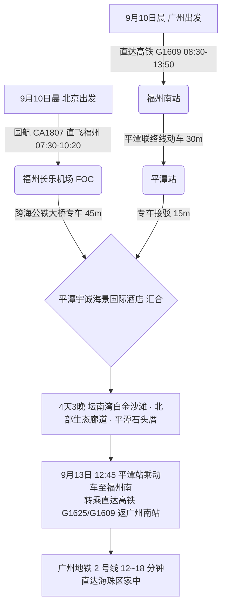

# 2026 福建平潭综合实验区 4 天 3 晚白金海岸坛南湾与石头厝风情出行计划导航

> **专案代号**：`pingtan`  
> **方案定制机构**：华夏纵横文旅智库旅行社  
> **出行周期**：2026 年 9 月 10 日（周四中午抵离汇合）至 9 月 13 日（周日傍晚返穗）· 4 天 3 晚  
> **北京端直飞枢纽**：北京首都 (PEK) / 大兴 (PKX) · 国航 CA1807 / 厦航 MF8102 直飞福州长乐 (FOC 10:20 落地) + 跨海专车 45 分钟直达平潭  
> **广州长辈高铁枢纽**：广州东站/广州南站 · 直达高铁 G1609 直达福州南站（08:30-13:50）+ 30 分钟平潭联络线动车直达平潭站  
> **终到闭环**：高铁联运返广州南站 → 广州地铁 2 号线 12~18 分钟直达海珠区家中圆满闭环  
> **专家联合签发**：总负责人 陆承远 · 规划总监 程若曦 · 特级导游 卫国强 · 历史学者 梁思涵 博士 · 地理学者 顾玄石 博士  
> **合规执行标准**：SOP-GOV-2026-001 内容真实性与商业实体四要素核验标准

---

## 1. 专案核心运筹与双端交通接驳

---

## 2. 平潭核心看点与适老特色

1. **坛南湾海滩（“白金海岸” · 避风天然海湾）**：
   - 滩长数公里，沙质白细如银，被称为平潭最优质的天然沙滩；三面环抱避风性极佳，风浪轻柔，滩涂平缓，适老漫步极佳；
2. **龙凤头海滨浴场**：
   - 砂质柔细，海岸线极其开阔，拥有平阔的观海长廊；
3. **北部生态廊道与长江澳风车田**：
   - 纯平悬空海景观景玻璃台，专车直抵观景机位，远眺蔚蓝大海与旋转风车；
4. **北港村石头厝聚落**：
   - 平潭特色花岗岩防风石屋群落，“会唱歌的石头”，领略海岛非遗手作与鲜美平潭海蛎煎、八亩焖冬粉。

---

## 3. 文件快速入口

- 📑 [平潭 4D3N 全景适老规划方案](file:///c:/Users/ASUS/Documents/Code/Local/AGENT-PLAYGROUND/travel-agency/plans/2026-09-05-to-09-13/fujian/pingtan/2026-09-10-beijing-to-pingtan-4d3n-travel-plan.md)
- 🌐 [平潭 4D3N 交互式 Web 门户](file:///c:/Users/ASUS/Documents/Code/Local/AGENT-PLAYGROUND/travel-agency/plans/2026-09-05-to-09-13/fujian/pingtan/index.html)
- 🔙 [返回福建专区总览](file:///c:/Users/ASUS/Documents/Code/Local/AGENT-PLAYGROUND/travel-agency/plans/2026-09-05-to-09-13/fujian/README.md)
