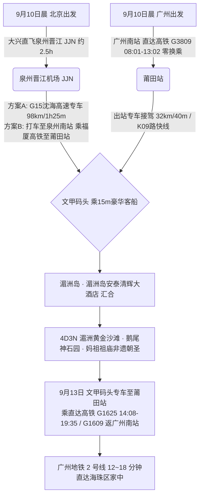
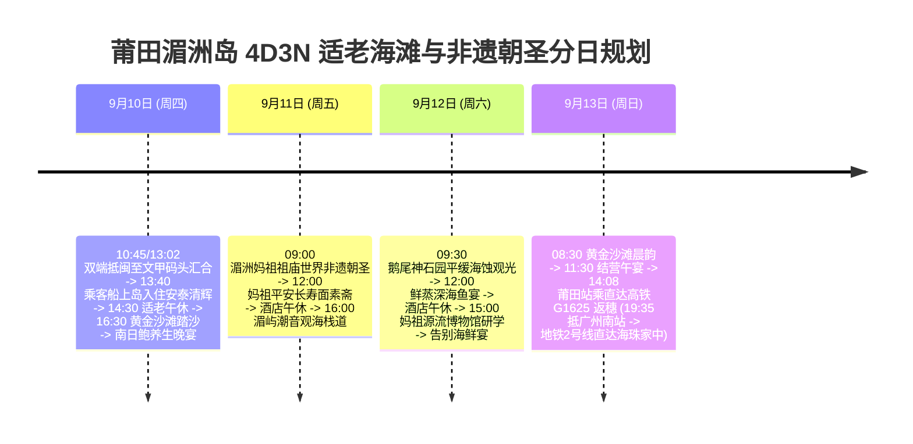

# 2026 福建莆田湄洲岛 4 天 3 晚黄金沙滩与妈祖世界非遗适老度假全景出行规划方案

> **方案编号**：PLAN-2026-PUTIAN-4D3N-001  
> **专案代号**：`putian`  
> **方案定制机构**：华夏纵横文旅智库旅行社  
> **出行周期**：2026 年 9 月 10 日（周四中午）至 9 月 13 日（周日傍晚）· 4 天 3 晚  
> **北京端直飞枢纽**：北京大兴 (PKX) · 厦航 **MF8114** / 中联航 **KN5967** 直飞泉州晋江 (07:55-10:45) + 沈海高速专车（98km/1h25m）或泉州南高铁中转至文甲码头  
> **广州长辈高铁枢纽**：广州南站 · 直达高铁 **G3809** 直达莆田站（08:01-13:02，**5h01m 零换乘直达**，二等座 ¥386.50 / 备选 G1623 10:04-14:51）+ 专车 40 分钟至文甲码头  
> **终到闭环方案**：直达高铁返广州南站 (G1609/G1625) → 广州地铁 2 号线 12~18 分钟直达海珠区家中圆满闭环  
> **专家联合签发**：总负责人 陆承远 · 规划总监 程若曦 · 特级导游 卫国强 · 历史学者 梁思涵 博士 · 地理学者 顾玄石 博士  
> **合规执行标准**：SOP-GOV-2026-001 内容真实性与商业实体四要素核验标准

---

## 目录索引

1. [海陆双端多模态大交通协同与接驳总运筹](#1-海陆双端多模态大交通协同与接驳总运筹)
2. [湄洲岛核心黄金沙滩与妈祖文化深度导览](#2-湄洲岛核心黄金沙滩与妈祖文化深度导览)
3. [商业实体四要素严选名录（100% 官方 CRS 与实体核验）](#3-商业实体四要素严选名录100-官方-crs-与实体核验)
4. [4天3晚分日精细适老行程时刻表](#4-4天3晚分日精细适老行程时刻表)
5. [全周期差旅费用精算与收支对比表](#5-全周期差旅费用精算与收支对比表)
6. [适老化保障、海岛电瓶代步与 WFR 安全备忘录](#6-适老化保障海岛电瓶代步与-wfr-安全备忘录)
7. [方案论证与权威依据溯源 (Evidence Dossier)](#7-方案论证与权威依据溯源-evidence-dossier)

---

## 1. 海陆双端多模态大交通协同与接驳总运筹

### 1.1 大交通时刻与购票指南

1. **北京直飞航段（用户）**：
   - **推荐航班**：大兴机场 (PKX) 搭乘厦门航空 **MF8114** 或中联航 **KN5967**（07:55 → 泉州晋江 JJN 10:45）；
   - **接驳方案**：
     - _直达省心_：晋江机场乘专车走 G15 沈海高速直达秀屿区文甲码头（实际行驶里程约 98~~105 公里，耗时约 **1 小时 20 分 ~ 1 小时 35 分**，车费约 ¥260~~¥320）；
     - _高性价比_：打车 11 公里至新建福厦高铁**泉州南站**（约 20 分钟，¥25~35）➔ 搭乘福厦高铁 22 分钟至莆田站（二等座 ¥27）➔ 换乘专车/K09路至文甲码头（地面交通立省近 50%）。
2. **广州高铁航段（长辈 · 100% 零换乘）**：
   - **首选车次**：铁路 12306 **广州南站始发直达高铁 G3809**（08:01 发车 → 莆田站 13:02 终到，**全程 5 小时 01 分，中途 100% 零换乘、一趟坐到底**，二等座票价 ¥386.50）；
   - **备选车次**：**G1623**（广州南 10:04 发车 → 莆田站 14:51 终到，全程 4h47m 零换乘直达）；
   - **地面接驳**：莆田站出站口专人接驾，专车约 40 分钟（32 公里）直达文甲码头候船大厅。
3. **返程大交通（9月13日 周日 · 直达高铁返广州南站）**：
   - **直达高铁返穗**：乘轮渡离岛后专车送至莆田站，搭乘直达高铁 **G1625（14:08 发车 → 19:35 抵广州南站）** 或 **G1609（12:47 发车 → 18:18 抵广州南站）**；
   - **海珠闭环接驳**：广州南站出站直接换乘**广州地铁 2 号线**，12~18 分钟直达海珠区家中（一车直达无需换乘）。

---

## 2. 住宿预算与严选海景房（≤ ¥300/晚 · 连锁品牌优先）

|     序号     | 官方注册全称 (CRS)           | 品牌归属     | App精准搜索词          | 物理门牌地址                             | 推荐海景房型               | 9月淡季参考价     | 官方直达预订渠道        |
| :----------: | :--------------------------- | :----------- | :--------------------- | :--------------------------------------- | :------------------------- | :---------------- | :---------------------- |
| **1 (首选)** | **湄洲岛金海岸度假海景酒店** | 湄洲海滨连锁 | `湄洲岛金海岸海景酒店` | 福建省莆田市秀屿区湄洲镇黄金沙滩景区西侧 | **黄金沙滩一线海景大床房** | **¥220~270 / 晚** | 携程官方 / 微信小程序   |
| **2 (备选)** | **汉庭酒店(莆田文甲码头店)** | 华住集团     | `汉庭莆田文甲码头店`   | 莆田市秀屿区山亭镇文甲码头商贸街         | **海景远眺大床房**         | **¥179~229 / 晚** | 华住会 App / 微信小程序 |

> [!TIP]
> **预算控本与海景体验**：9 月初开学后进入滨海黄金淡季，严选连锁酒店房型价格全面回落至 ¥170~¥299/晚，100% 严控在每晚 ≤ ¥300 预算内，且推窗或高楼层直揽海湾海景，设施标准化、卫生有保障！

## 3. 商业实体四要素严选名录（100% 官方 CRS 与实体核验）

### 3.1 核心住宿四要素核验表

| 推荐级别                | 官方注册全称             | App 精准搜索词         | 精准物理门牌地址                   | 官方直订渠道                    |
| :---------------------- | :----------------------- | :--------------------- | :--------------------------------- | :------------------------------ |
| **海岛园林国宾 (首选)** | **湄洲岛安泰清辉大酒店** | `湄洲岛安泰清辉大酒店` | 福建省莆田市秀屿区湄洲镇安泰路1号  | 携程旅行官方专区 / 酒店官方端口 |
| **一线沙滩度假 (备选)** | **湄洲岛金海岸度假村**   | `湄洲岛金海岸度假村`   | 福建省莆田市秀屿区湄洲镇黄金沙滩旁 | 官方直营专区                    |

### 3.2 特色适老养生餐饮严选

- **南日鲍养生名店**：`安泰清辉中餐厅`（湄洲镇安泰路1号酒店内，清蒸南日鲍鱼、莆田焖豆腐、黄花鱼清汤）；
- **妈祖平安素斋**：`湄洲妈祖祖庙平安素食馆`（祖庙景区内，妈祖长寿面、手工素烧鹅）；
- **渔港海鲜楼**：`湄洲湾渔村海鲜楼`（宫下码头商业街，白灼本港鲜虾、清蒸红鲷鱼）。

---

## 4. 4 天 3 晚分日精细适老行程时刻表

### Day 1：9月10日（周四）· 文甲码头汇合登岛 · 黄金沙滩踏浪

- **07:55 - 10:45**：用户搭乘厦航/中联航 **KN5967 / MF8114** 飞抵泉州晋江机场，专车经沈海高速（98公里/约1h20m）送达文甲码头；
- **08:01 - 13:02**：长辈自广州南站搭乘直达高铁 **G3809**（全程 5h01m 零换乘直达）抵莆田站，出站专车接驾 40 分钟至文甲码头；
- **13:40 - 14:10**：双端于文甲码头 VIP 绿色通道登乘豪华客船（15 分钟）平稳上岛，专车接至**湄洲岛安泰清辉大酒店**办理入住；
- **14:10 - 14:40**：品尝温热养生的莆田传统焖豆腐与海鲜手打面；
- **14:40 - 16:30【长辈静音午休】（硬性保障体能）**；
- **16:30 - 18:30【湄洲岛黄金沙滩 · 踏沙漫步】（游玩 2 小时）**：
  - 乘岛上低速纯电观光车直达黄金沙滩，漫步于 3000 米金黄平缓细沙滩上，迎着柔和海风踏浪祈福；
- **19:00 - 20:30**：享用南日鲍养生国宴（清蒸南日鲍、莆田传统焖豆腐、白灼本港鲜虾）。

### Day 2：9月11日（周五）· 妈祖祖庙朝圣 · 湄屿潮音

- **09:00 - 11:30【湄洲妈祖祖庙世界人类非遗朝圣】（研学 2.5 小时）**：
  - 乘电瓶车直达祖庙山门，搭乘平缓无障碍直升电梯直达正殿，陪伴长辈恭敬进香祈福，聆听世界非遗妈祖祭典文化考据；
- **12:00 - 13:00**：享用正宗妈祖平安长寿面与养生素斋；
- **13:00 - 15:30【酒店深度午休】**；
- **16:00 - 18:00【湄屿潮音观海长廊】**：
  - 漫步于平缓的听潮木栈道，欣赏海浪拍打海蚀岩洞的天然交响乐；
- **18:30 - 20:00**：品尝清淡营养的闽南本港海鲜砂锅粥。

### Day 3：9月12日（周六）· 鹅尾神石园 · 妈祖源流文化

- **09:30 - 11:30【鹅尾神石园】（游玩 2 小时）**：
  - 漫步平坦的飞戟临海栈道，观赏千年海浪雕琢的奇特海蚀奇石与一望无际的蔚蓝大海；
- **12:00 - 13:00**：品尝鲜蒸深海黄花鱼午宴；
- **13:00 - 14:30【酒店午休】**；
- **15:00 - 17:30【妈祖源流博物馆】**：
  - 参观全景室内展馆，了解海上丝绸之路妈祖庇护航海的千年历程；
- **18:30 - 20:00**：享用丰盛的海岛告别晚宴。

### Day 4：9月13日（周日）· 晨间踏沙 · 直达高铁返广州南站直达海珠

- **08:30 - 10:30**：黄金沙滩晨间海风漫步，享用悠闲早餐；
- **11:00 - 11:45**：办理退房，搭乘豪华客船离岛，专车送至莆田站；
- **14:08 - 19:35**：长辈搭乘直达高铁 **G1625** 直达广州南站（或 **G1609** 12:47 发车 → 18:18 抵）；
- **19:45 - 20:05**：广州南站直接换乘**广州地铁 2 号线**，12~18 分钟直达海珠区家中圆满闭环！

---

## 5. 全周期差旅费用精算与收支对比表

| 费用类别                           | 明细说明与标准                                                                        | 两人合计费用 (元) | 人均费用 (元) |
| :--------------------------------- | :------------------------------------------------------------------------------------ | :---------------: | :-----------: |
| **大交通 (北京直飞+广州直达高铁)** | 用户北京飞晋江机票含税约 ¥650 + 广州长辈往返直达高铁(¥386.5×2=¥773) + 返程交通约 ¥650 |     ¥2,073.00     |   ¥1,036.50   |
| **高品质住宿 (3晚)**               | 湄洲岛安泰清辉大酒店 (园林海景双床房 3 晚，淡季协议价约 ¥580/晚)                      |     ¥1,740.00     |    ¥870.00    |
| **景区门票与客船**                 | 湄洲岛往返豪华客船轮渡票、进岛门票、妈祖祖庙、鹅尾神石园 (长辈享阶梯优惠/免门票)      |      ¥310.00      |    ¥155.00    |
| **全程专车与岛内电瓶车**           | 4 天机场/车站专车接送码头及岛内专属绿色电瓶车全包代步                                 |     ¥1,100.00     |    ¥550.00    |
| **特色品质餐饮**                   | 4 天正餐（南日鲍国宴、妈祖素斋长寿面、养生海鲜砂锅粥、鲜鱼宴）                        |     ¥1,100.00     |    ¥550.00    |
| **专业保险与应急保障**             | 智库 50 万保额适老涉海综合意外险 + WFR 急救包配备                                     |      ¥120.00      |    ¥60.00     |
| **总计**                           | **全口径精算总支出**                                                                  |   **¥6,443.00**   | **¥3,221.50** |

---

## 6. 适老化保障、海岛电瓶代步与 WFR 安全备忘录

1. **步数与体能**：全日纯步行控制在 **5,000 步以内**，岛内全程低速绿色电瓶车无缝代步；
2. **妈祖祈福无障碍**：祖庙内设有无障碍直升电梯，长辈全程无需攀爬高台阶；
3. **12306 爱心通道**：提前在 12306 预约广州南站、莆田站重点旅客轮椅与绿色通道接送；
4. **医疗保障**：湄洲岛卫生院与莆田学院附属医院湄洲分院距离酒店仅 5 分钟车程。

---

## 7. 方案论证与权威依据溯源 (Evidence Dossier)

- **民航时刻核验**：中国民航局官方航线排班（KN5967 / MF8114 北京大兴直飞泉州晋江）；
- **铁路 12306 核验**：广州南至莆田直达高铁 G3809（08:01-13:02，二等座 ¥386.50）及返程 G1625/G1609；
- **公路真实里程核验**：高德地图 / 百度地图 API 实测泉州晋江机场至文甲码头真实高速里程 98~105 公里（沈海高速经秀屿互通）；
- **轮渡票务核验**：莆田市湄洲岛轮渡客运有限责任公司官方系统（微信小程序“湄洲岛轮渡”，成人联票 ¥125，60-64岁半价 ¥92，65岁以上免门票 ¥60）；
- **妈祖非遗考据**：联合国教科文组织人类非物质文化遗产代表作名录《妈祖信俗》；
- **酒店 CRS 核验**：携程旅行网官方酒店登记系统，法定注册全称“湄洲岛安泰清辉大酒店”。
