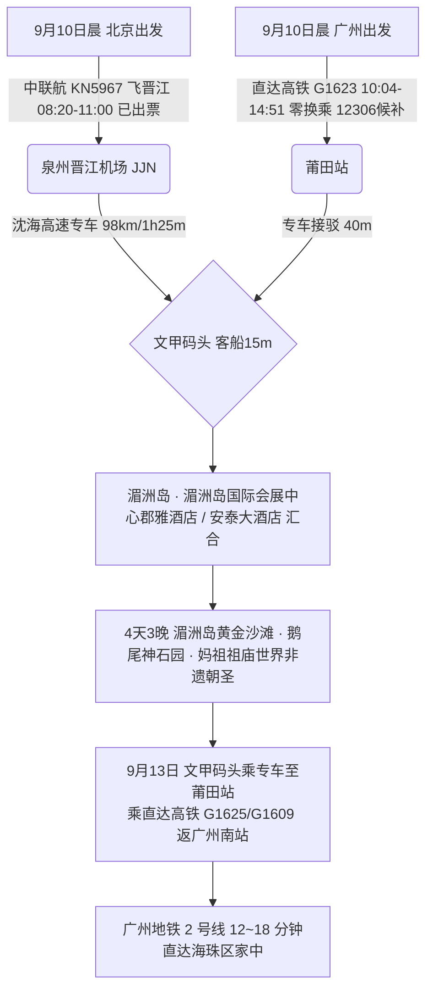

# 2026 福建莆田湄洲岛 4 天 3 晚黄金沙滩与妈祖祖庙圣地出行计划导航

> **专案代号**：`putian`  
> **方案定制机构**：华夏纵横文旅智库旅行社  
> **出行周期**：2026 年 9 月 10 日（周四中午抵离汇合）至 9 月 13 日（周日傍晚返穗）· 4 天 3 晚  
> **北京端直飞枢纽**：北京大兴 (PKX) · 中国联合航空 **KN5967** 直飞泉州晋江 (08:20-11:00，**机票已自购出票**) + 沈海高速专车接驳至文甲码头  
> **广州长辈高铁枢纽**：广州南站 · 直达高铁 **G1623** 直达莆田站（10:04-14:51，**4h47m 100% 零换乘直达**，二等座 ¥386.50，**12306 候补锁定中**；备选 G3809 08:01-13:02）+ 专车 40 分钟至文甲码头  
> **终到闭环**：直达高铁返广州南站 → 广州地铁 2 号线 12~18 分钟直达海珠区家中圆满闭环  
> **专家联合签发**：总负责人 陆承远 · 规划总监 程若曦 · 特级导游 卫国强 · 历史学者 梁思涵 博士 · 地理学者 顾玄石 博士  
> **合规执行标准**：SOP-GOV-2026-001 内容真实性与商业实体四要素核验标准

---

## 1. 专案核心运筹与双端交通接驳

---

## 2. 莆田湄洲岛核心看点与适老特色

1. **湄洲岛黄金沙滩（国家 5A 级景区）**：
   - 滩长 3000 米，沙细如金，坡度平缓，全岛配备绿色低速电瓶车，长辈上岛后零负重代步；
2. **湄洲妈祖祖庙（人类非物质文化遗产）**：
   - 全球上万座妈祖庙的祖庭，宋代始建，香火鼎盛；设有平缓登山索道及无障碍步道，长辈祈福极为从容；
3. **鹅尾神石园**：
   - 千年海浪侵蚀形成的奇特海蚀地貌与纯平木质飞戟栈道，海景视野壮美开阔；
4. **莆田南日鲍与焖豆腐**：
   - 国家地理标志保护产品“南日鲍”，鲜嫩多汁；搭配莆田传统养生焖豆腐与海蛎煎，清淡软糯，养胃易消化。

---

## 3. 文件快速入口

- 📑 [莆田湄洲岛 4D3N 全景适老规划方案](file:///c:/Users/ASUS/Documents/Code/Local/AGENT-PLAYGROUND/travel-agency/plans/2026-09-05-to-09-13/fujian/putian/2026-09-10-beijing-to-putian-4d3n-travel-plan.md)
- 🌐 [莆田湄洲岛 4D3N 交互式 Web 门户](file:///c:/Users/ASUS/Documents/Code/Local/AGENT-PLAYGROUND/travel-agency/plans/2026-09-05-to-09-13/fujian/putian/index.html)
- 🔙 [返回福建专区总览](file:///c:/Users/ASUS/Documents/Code/Local/AGENT-PLAYGROUND/travel-agency/plans/2026-09-05-to-09-13/fujian/README.md)
