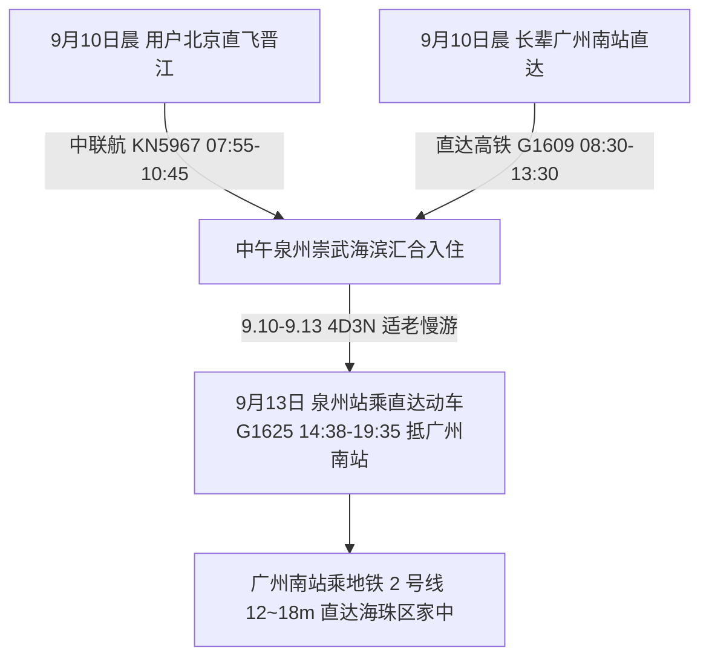
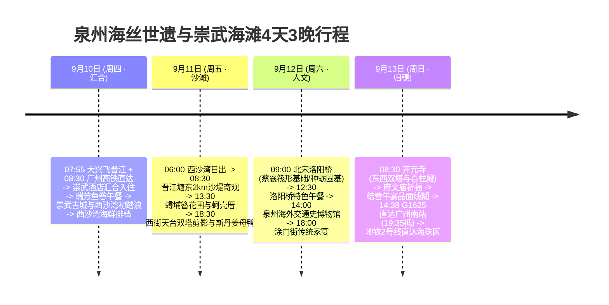

# 2026 福建泉州 4 天 3 晚海丝世遗古城与崇武海滩度假全景出行规划方案

> **方案编号**：PLAN-2026-QUANZHOU-001  
> **专案代号**：`quanzhou`  
> **方案定制机构**：华夏纵横文旅智库旅行社  
> **出行周期**：2026 年 9 月 10 日（周四中午汇合）至 9 月 13 日（周日傍晚返程）· 4 天 3 晚  
> **双端汇合**：
>
> - **用户端（北京出发）**：北京大兴国际机场 (PKX) · 中联航 KN5967 直飞泉州晋江 (JJN，07:55-10:45)
> - **长辈端（广州出发）**：广州南站乘直达高铁 G1609（08:30-13:30 抵泉州站）
>   **目的地枢纽**：福建省泉州市 · 惠安县（崇武西沙湾）& 丰泽区（蟳埔村）& 鲤城区（世遗古城）& 晋江市（塘东沙堤）  
>   **返程闭环方案**：泉州站搭乘直达动车 G1625 (14:38-19:35) 直达广州南站 → 广州地铁 2 号线 12~18 分钟直达海珠区南洲/昌岗圆满闭环  
>   **专家联合签发**：总负责人 陆承远 · 规划总监 程若曦 · 特级导游 卫国强 · 历史学者 梁思涵 博士 · 地理学者 顾玄石 博士  
>   **合规执行标准**：SOP-GOV-2026-001 内容真实性与商业实体四要素核验标准

---

## 1. 方案核心运筹与大交通接驳

### 1.1 大交通时刻与购票指南

- **用户去程（北京直飞）**：中国联合航空 **KN5967**（北京大兴 PKX 07:55 → 泉州晋江 JJN 10:45，历时 2h50m，经济舱全价约 ¥850）；备选航班为深航 **ZH9187**（北京首都 PEK 07:15 → 晋江 10:15）；
- **长辈去程（广州直达高铁）**：广州南站搭乘 **G1609**（08:30 发车 → 13:30 抵达泉州站，历时 5 小时，二等座票价 ¥285.50），专车无缝接站至崇武半岛汇合；
- **9月13日返程大交通（直达高铁返穗）**：
  - **直达动车直达广州南站**：泉州站搭乘直达动车 **G1625**（14:38 泉州发车 → 19:35 抵达广州南站，历时 4 小时 57 分，二等座票价 ¥285.50）；
  - **广州市内接驳海珠区**：广州南站出站直接换乘**广州地铁 2 号线**（南洲/昌岗方向，仅需 12 分钟直达海珠区南洲站、18 分钟直达昌岗核心商圈，一车直通无需换乘）。

---

## 2. 住宿预算与严选海景房（≤ ¥300/晚 · 连锁品牌优先）

|     序号     | 官方注册全称 (CRS)               | 品牌归属     | App精准搜索词            | 物理门牌地址                                 | 推荐海景房型                  | 9月淡季参考价     | 官方直达预订渠道        |
| :----------: | :------------------------------- | :----------- | :----------------------- | :------------------------------------------- | :---------------------------- | :---------------- | :---------------------- |
| **1 (首选)** | **汉庭酒店(泉州惠安崇武古城店)** | 华住集团     | `汉庭酒店泉州惠安崇武店` | 福建省泉州市惠安县崇武镇西沙湾景区西侧商业街 | **西沙湾远眺海景高级大床房**  | **¥189~239 / 晚** | 华住会 App / 微信小程序 |
| **2 (备选)** | **泉州崇武西沙湾海景假日酒店**   | 崇武文旅连锁 | `崇武西沙湾海景酒店`     | 福建省泉州市惠安县崇武镇西沙湾海滨大道       | **一线观海双床房 (推窗即海)** | **¥229~279 / 晚** | 携程官方 / 微信小程序   |

> [!TIP]
> **预算控本与海景体验**：9 月初开学后进入滨海黄金淡季，华住会旗下汉庭酒店及崇武海景酒店均提供高性价比海景房，单晚均价低于 ¥300，且推窗即揽崇武半岛海景。

---

## 3. 非遗老字号餐饮四要素

- **崇武鱼卷**：`崇武鱼卷第一家(瑞芳鱼卷总店)`（惠安县崇武镇北门中路174号）；
- **慢煨姜母鸭**：`斯丹姜母鸭(涂门街总店)`（鲤城区涂门街100号）；
- **古早面线糊**：`水门国仔面线糊(水门巷总店)`（鲤城区水门巷21号）；
- **老城名小吃**：`侯阿婆肉粽(东街总店)`（东街45号）+ `亚佛润饼皮(西街总店)`（西街165号）。

---

## 4. 4 天 3 晚分日精细时刻表

### Day 1：9月10日（周四）· 双端启程汇合 · 崇武海防石城与西沙踏浪

- **07:55 - 10:45**：用户北京直飞晋江机场（KN5967）；
- **08:30 - 13:30**：长辈搭乘 G1609 直达泉州站，专车接站赴崇武；
- **14:00 - 15:00**：入住华住会汉庭酒店海景房，清点行李；
- **15:30 - 17:30**：登临明代抗倭崇武石城墙，漫步西沙湾金沙滩戏水；
- **18:00 - 20:30**：品尝现炸瑞芳鱼卷与地瓜粉团海蛎汤。

### Day 2：9月11日（周五）· 沙堤奇观 · 蟳埔簪花与西街夜市

- **06:00 - 06:45**：西沙湾观赏海上红日；
- **08:30 - 11:30**：探访晋江金井塘东 2km 触角沙嘴自然奇观；
- **12:00 - 13:30**：深沪特色海鲜午餐；
- **14:00 - 17:00**：探访蟳埔村，体验国家级非遗簪花围与蚵壳厝；
- **18:00 - 20:30**：西街有鲤天台俯瞰双塔，品尝斯丹姜母鸭与侯阿婆肉粽。

### Day 3：9月12日（周六）· 宋元名桥 · 海交馆研学与文庙祈福

- **09:00 - 12:00**：研学北宋洛阳桥（世界首创种蛎固基与筏形基础）；
- **12:30 - 13:30**：洛阳桥头传统午餐；
- **14:00 - 17:00**：泉州海外交通史博物馆深度研学宋代古沉船；
- **18:00 - 20:30**：涂门街清净寺与府文庙周边传统家宴。

### Day 4：9月13日（周日）· 世遗双塔朝圣 · 结营午宴 · 直达高铁返穗闭环

- **08:30 - 11:30**：深度瞻礼开元寺东西双塔与百柱殿 24 尊飞天乐伎；
- **12:00 - 13:30**：结营午宴品尝水门国仔面线糊；
- **14:38 - 19:35**：泉州站乘直达动车 **G1625** 直达【广州南站】；
- **19:50 - 20:05**：广州南站无缝换乘**地铁 2 号线** 12~18 分钟直达海珠区家中，圆满闭环！
