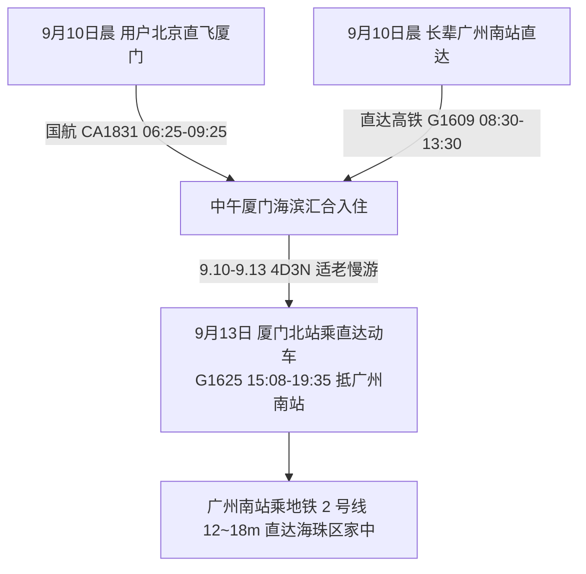
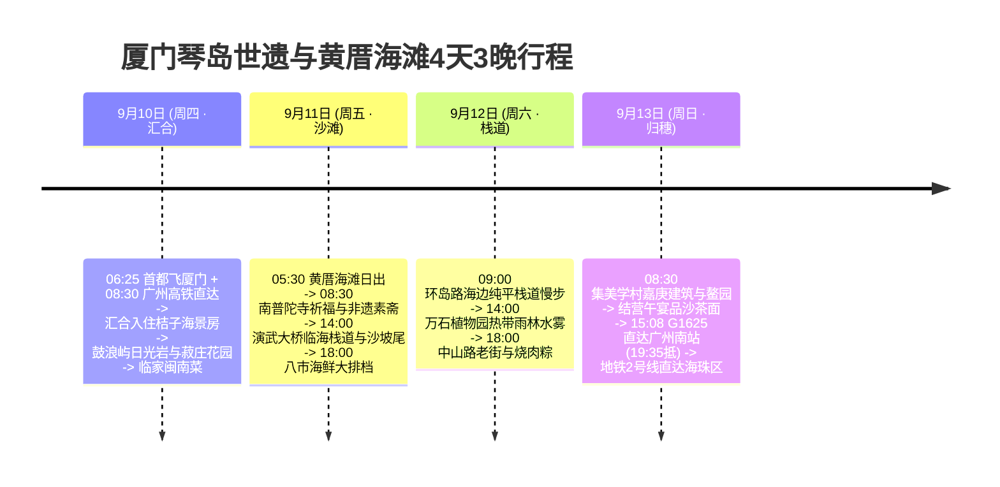

# 2026 福建厦门 4 天 3 晚琴岛世遗与黄厝海滩度假全景出行规划方案

> **方案编号**：PLAN-2026-XIAMEN-001  
> **专案代号**：`xiamen`  
> **方案定制机构**：华夏纵横文旅智库旅行社  
> **出行周期**：2026 年 9 月 10 日（周四中午汇合）至 9 月 13 日（周日傍晚返程）· 4 天 3 晚  
> **双端汇合**：
>
> - **用户端（北京出发）**：北京首都国际机场 (PEK) · 国航 CA1831 直飞厦门高崎 (XMN，06:25-09:25)
> - **长辈端（广州出发）**：广州南站乘直达高铁 G1609（08:30-13:30 抵厦门北站）
>   **目的地枢纽**：福建省厦门市 · 思明区（鼓浪屿、黄厝海滩、环岛路、南普陀）& 集美区（集美学村）  
>   **返程闭环方案**：厦门北站搭乘直达动车 G1625 (15:08-19:35) 直达广州南站 → 广州地铁 2 号线 12~18 分钟直达海珠区南洲/昌岗圆满闭环  
>   **专家联合签发**：总负责人 陆承远 · 规划总监 程若曦 · 特级导游 卫国强 · 历史学者 梁思涵 博士 · 地理学者 顾玄石 博士  
>   **合规执行标准**：SOP-GOV-2026-001 内容真实性与商业实体四要素核验标准

---

## 1. 方案核心运筹与大交通接驳

### 1.1 大交通时刻与购票指南

- **用户去程（北京直飞）**：中国国际航空 **CA1831**（北京首都 PEK 06:25 → 厦门高崎 XMN 09:25，历时 3h00m，经济舱全价约 ¥920）；
- **长辈去程（广州直达高铁）**：广州南站搭乘 **G1609**（08:30 发车 → 13:30 抵达厦门北站，历时 5 小时，二等座票价 ¥254.50），专车无缝接站汇合；
- **9月13日返程大交通（直达高铁返穗）**：
  - **直达动车直达广州南站**：厦门北站搭乘直达动车 **G1625**（15:08 厦门北发车 → 19:35 抵达广州南站，历时 4 小时 27 分，二等座票价 ¥254.50）；
  - **广州市内接驳海珠区**：广州南站出站直接换乘**广州地铁 2 号线**（南洲/昌岗方向，仅需 12 分钟直达海珠区南洲站、18 分钟直达昌岗核心商圈，一车直通无需换乘）。

---

## 2. 住宿预算与严选海景房（≤ ¥300/晚 · 华住会连锁优先）

|     序号     | 官方注册全称 (CRS)                     | 品牌归属 | App精准搜索词                | 物理门牌地址                    | 推荐海景房型                 | 9月淡季参考价     | 官方直达预订渠道        |
| :----------: | :------------------------------------- | :------- | :--------------------------- | :------------------------------ | :--------------------------- | :---------------- | :---------------------- |
| **1 (首选)** | **桔子酒店(厦门国际会展中心高雄路店)** | 华住集团 | `桔子酒店厦门国际会展中心店` | 福建省厦门市思明区高雄路1号     | **高级环岛路观景海景大床房** | **¥259~299 / 晚** | 华住会 App / 微信小程序 |
| **2 (备选)** | **汉庭酒店(厦门大学店)**               | 华住集团 | `汉庭酒店厦门大学店`         | 福建省厦门市思明区思明南路497号 | **高楼层海景大床房**         | **¥219~269 / 晚** | 华住会 App / 微信小程序 |

> [!TIP]
> **预算控本与海景体验**：9 月开学后进入淡季，华住会旗下桔子酒店与汉庭酒店价格回落至 ¥219~¥299/晚，精准控制在每晚 ≤ ¥300 预算内，且邻近黄厝沙滩与环岛路。

---

## 3. 非遗老字号餐饮四要素

- **慢煨姜母鸭**：`临家闽南菜(环岛路店)`（思明区环岛南路308号）；
- **市井小吃**：`乌糖沙茶面(民族路店)`（思明区民族路60号）；
- **八市海鲜**：`阿杰五香(八市总店)`（思明区开元路111号）；
- **传统名点**：`1980烧肉粽(中山路总店)`（思明区中山路353号）。

---

## 4. 4 天 3 晚分日精细时刻表

### Day 1：9月10日（周四）· 双端启程汇合 · 鼓浪屿万国建筑博览

- **06:25 - 09:25**：用户北京直飞厦门高崎机场（CA1831）；
- **08:30 - 13:30**：长辈搭乘 G1609 直达厦门北站，专车接站汇合；
- **14:00 - 17:30**：邮轮码头平稳登岛，研学鼓浪屿万国建筑博览，登日光岩俯瞰全岛，游菽庄花园藏海借景；
- **18:00 - 20:30**：入住华住会桔子酒店观景房，品尝临家闽南菜与翔安姜母鸭。

### Day 2：9月11日（周五）· 黄厝日出 · 南普陀祈福与沙坡尾

- **05:30 - 06:30**：黄厝海滩静候海上朝阳；
- **08:30 - 11:30**：南普陀寺祈福，品尝非遗半月沉江素斋；
- **14:00 - 17:00**：漫步演武大桥临海观景栈道与沙坡尾避风坞；
- **18:00 - 20:30**：第八菜市场品尝阿杰五香条与本港海鲜大排档。

### Day 3：9月12日（周六）· 环岛绿道 · 植物园仙境与中山路

- **09:00 - 12:00**：环岛路纯平海边木栈道慢调漫步；
- **14:00 - 17:00**：万石植物园电瓶车直达热带雨林仙境水雾；
- **18:00 - 20:30**：中山路品尝 1980 烧肉粽与土笋冻。

### Day 4：9月13日（周日）· 嘉庚风骨 · 结营午宴 · 直达高铁返穗闭环

- **08:30 - 11:30**：探访集美学村嘉庚建筑群与鳌园石雕；
- **12:00 - 13:30**：结营午宴品尝乌糖沙茶面与同安封肉；
- **15:08 - 19:35**：厦门北站乘直达动车 **G1625** 直达【广州南站】；
- **19:50 - 20:05**：广州南站无缝换乘**地铁 2 号线** 12~18 分钟直达海珠区家中，圆满闭环！
