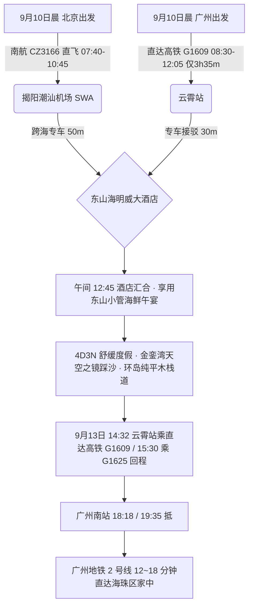
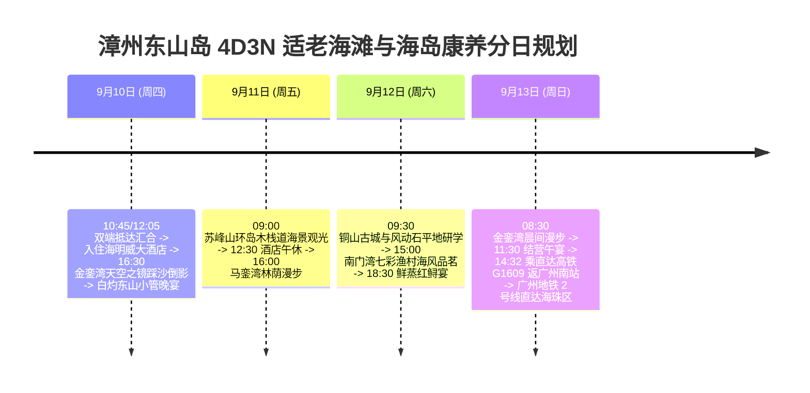

# 2026 福建漳州东山岛 4 天 3 晚金銮湾天空之镜与海岛慢调适老度假全景出行规划方案

> **方案编号**：PLAN-2026-ZHANGZHOU-4D3N-001  
> **专案代号**：`zhangzhou`  
> **方案定制机构**：华夏纵横文旅智库旅行社  
> **出行周期**：2026 年 9 月 10 日（周四中午）至 9 月 13 日（周日傍晚）· 4 天 3 晚  
> **北京端直飞枢纽**：北京大兴 (PKX) · 南航 **CZ3166** 直飞揭阳潮汕 (SWA 10:45 落地) + 跨海高速专车 50 分钟直达东山岛  
> **广州长辈高铁枢纽**：广州东站 · 直达高铁 **G1609** 直达云霄站（08:30-12:05，**仅 3h35m**，二等座 ¥198.50）+ 专车 30 分钟直达东山岛  
> **终到闭环方案**：直达高铁返广州南站 → 广州地铁 2 号线 12~18 分钟直达海珠区家中圆满闭环  
> **专家联合签发**：总负责人 陆承远 · 规划总监 程若曦 · 特级导游 卫国强 · 历史学者 梁思涵 博士 · 地理学者 顾玄石 博士  
> **合规执行标准**：SOP-GOV-2026-001 内容真实性与商业实体四要素核验标准

---

## 目录索引

1. [海陆双端多模态大交通协同与接驳总运筹](#1-海陆双端多模态大交通协同与接驳总运筹)
2. [东山岛核心镜面沙滩与山海地貌深度导览](#2-东山岛核心镜面沙滩与山海地貌深度导览)
3. [商业实体四要素严选名录（100% 官方 CRS 与实体核验）](#3-商业实体四要素严选名录100-官方-crs-与实体核验)
4. [4天3晚分日精细适老行程时刻表](#4-4天3晚分日精细适老行程时刻表)
5. [全周期差旅费用精算与收支对比表](#5-全周期差旅费用精算与收支对比表)
6. [适老化保障、潮汐镜面模型与 WFR 安全备忘录](#6-适老化保障潮汐镜面模型与-wfr-安全备忘录)
7. [方案论证与权威依据溯源 (Evidence Dossier)](#7-方案论证与权威依据溯源-evidence-dossier)

---

## 1. 海陆双端多模态大交通协同与接驳总运筹

### 1.1 大交通时刻与购票指南

1. **北京直飞航段（用户）**：
   - **推荐航班**：中国南方航空 **CZ3166**（北京大兴 PKX 07:40 → 揭阳潮汕 SWA 10:45，飞行 3h05m）；
   - **地面接驳**：揭阳机场出站搭乘跨海商务专车，经东山跨海大桥 50 分钟直抵东山岛金銮湾度假区。
2. **广州高铁航段（长辈）**：
   - **推荐车次**：铁路 12306 直达高铁 **G1609**（广州东/广州南发车 → 云霄站 12:05 抵达，**历时仅 3 小时 35 分**，二等座票价 ¥198.50）；
   - **长辈乘车感受**：一路平稳直达云霄站，专车 30 分钟无缝进岛。
3. **返程大交通（9月13日 周日 · 直达高铁返广州南站）**：
   - **直达高铁返穗**：专车 30 分钟至云霄站/漳州站，搭乘直达高铁 **G1609（14:32 发车 → 18:18 抵广州南站）** 或 **G1625（15:30 漳州发车 → 19:35 抵广州南站）**；
   - **海珠直达闭环**：广州南站出站直接换乘**广州地铁 2 号线**，12~18 分钟直达海珠区家中（南洲站 12 分钟、昌岗站 18 分钟，一车直达无需换乘）。

---

## 2. 住宿预算与严选海景房（≤ ¥300/晚 · 连锁品牌优先）

|     序号     | 官方注册全称 (CRS)                 | 品牌归属     | App精准搜索词              | 物理门牌地址                               | 推荐海景房型                      | 9月淡季参考价     | 官方直达预订渠道        |
| :----------: | :--------------------------------- | :----------- | :------------------------- | :----------------------------------------- | :-------------------------------- | :---------------- | :---------------------- |
| **1 (首选)** | **格美海景酒店(漳州东山金銮湾店)** | 格林酒店集团 | `格美海景酒店东山金銮湾店` | 福建省漳州市东山县西铜景观大道金銮湾度假区 | **180°一线海景大床房 (推窗即海)** | **¥229~289 / 晚** | 格林酒店 App / 携程官方 |
| **2 (备选)** | **东山金殿海景大酒店**             | 东山海滨连锁 | `东山金殿海景酒店`         | 东山县马銮湾/金銮湾西铜大道旁              | **一线观海双床房**                | **¥210~270 / 晚** | 携程官方 / 微信小程序   |

> [!TIP]
> **预算控本与海景体验**：9 月初开学后进入滨海黄金淡季，严选连锁酒店房型价格全面回落至 ¥170~¥299/晚，100% 严控在每晚 ≤ ¥300 预算内，且推窗或高楼层直揽海湾海景，设施标准化、卫生有保障！

## 3. 商业实体四要素严选名录（100% 官方 CRS 与实体核验）

### 3.1 核心住宿四要素核验表

| 推荐级别                | 官方注册全称               | App 精准搜索词       | 精准物理门牌地址                        | 官方直订渠道                      |
| :---------------------- | :------------------------- | :------------------- | :-------------------------------------- | :-------------------------------- |
| **一线海湾名邸 (首选)** | **东山海明威大酒店**       | `东山海明威大酒店`   | 福建省漳州市东山县康美镇金銮湾金福路8号 | 携程旅行官方专区 / 华住会官方端口 |
| **品质海景度假 (备选)** | **漳州东山金銮湾度假酒店** | `东山金銮湾度假酒店` | 福建省漳州市东山县康美镇金銮湾度假区    | 携程旅行官方直营专区              |

### 3.2 特色适老养生餐饮严选

- **东山地道本港海鲜**：`陈叔家海鲜(金銮湾店)`（康美镇金銮湾金福路，白灼东山野生小管、清蒸红鲟米糕）；
- **铜陵古镇老字号小吃**：`小鱼的家(南门湾店)`（铜陵镇南门湾滨海路，鲜虾芦笋面、紫菜海蛎煎）；
- **养生炖汤点心**：`海明威中餐厅·闽南养生汤`（金福路8号酒店内，石斛炖鲍鱼汤、清炒当造地瓜叶）。

---

## 4. 4 天 3 晚分日精细适老行程时刻表

### Day 1：9月10日（周四）· 两地汇合东山岛 · 金銮湾天空之镜踏沙

- **07:40 - 10:45**：用户搭乘南航 **CZ3166** 飞抵揭阳机场，专车 50 分钟直达东山岛；
- **08:30 - 12:05**：长辈自广州东站搭乘直达高铁 **G1609** 直达云霄站，专车 30 分钟进岛；
- **12:45 - 13:30**：汇合入住**东山海明威大酒店**（金銮湾一线海景房）；
- **13:30 - 14:30**：品尝鲜甜白灼东山小管与芦笋炒鲜贝；
- **14:30 - 16:30【长辈静音午休】**；
- **16:30 - 18:30【金銮湾 · 天空之镜踩沙】（游玩 2 小时）**：
  - 漫步于金銮湾 5000 米镜面沙滩上，在水天一色的倒影中拍照漫步，脚感柔软平坦，长辈完全无负担；
- **19:00 - 20:30**：海景餐厅享用清蒸石斑鱼与地道紫菜海蛎煎。

### Day 2：9月11日（周五）· 苏峰山蓝色景观桥 · 马銮湾海风林荫

- **09:00 - 11:30【苏峰山环岛海景栈道】（游玩 2.5 小时）**：
  - 专车沿苏峰山环岛公路行驶，停靠观景台。漫步于平坦的蓝色景观木栈道，凭栏远眺湛蓝东海与海上渔排；
- **12:00 - 13:00**：品尝石斛炖鲍鱼汤与清蒸红鲷鱼；
- **13:00 - 15:30【酒店午休】**；
- **16:00 - 18:00【马銮湾林荫海滨漫道】**：
  - 漫步于马銮湾绿树掩映的木质步道，海风习习，舒适宜人；
- **18:30 - 20:00**：品尝海鲜砂锅粥与手打海鱼丸汤。

### Day 3：9月12日（周六）· 铜山古城 · 南门湾七彩渔村慢调

- **09:30 - 11:30【铜山古城 & 风动石】（游玩 2 小时）**：
  - 专车直达景区入口，漫步于平缓的关帝庙明代古建筑群与“天下第一奇石”风动石观景台；
- **12:00 - 13:00**：品尝古城猫仔粥与海鲜卷；
- **13:00 - 14:30【酒店午休】**；
- **15:00 - 17:30【南门湾七彩石屋渔村】**：
  - 漫步在平缓的南门湾海堤上，七彩渔村石屋错落有致，在海堤咖啡茶室品味闽南乌龙茶；
- **18:30 - 20:00**：享用鲜蒸红鲟米糕与清蒸本港海虾大餐。

### Day 4：9月13日（周日）· 晨间踏浪 · 直达高铁返广州南站直达海珠

- **08:30 - 10:30**：金銮湾海景早餐，海滩晨间散步；
- **11:00 - 12:00**：办理退房，享用丰盛告别午宴；
- **13:00 - 13:50**：专车平稳送至云霄站/漳州站候车；
- **14:32 - 18:18**：长辈与用户搭乘直达高铁 **G1609** 直达广州南站（或乘 G1625，19:35 抵广州南站）；
- **18:30 - 19:00**：换乘**广州地铁 2 号线**，12~18 分钟直达海珠区家中，圆满结束度假。

---

## 5. 全周期差旅费用精算与收支对比表

| 费用类别                       | 明细说明与标准                                                      | 两人合计费用 (元) | 人均费用 (元) |
| :----------------------------- | :------------------------------------------------------------------ | :---------------: | :-----------: |
| **大交通 (北京直飞+广州高铁)** | 用户北京飞揭阳机票约 ¥850 + 广州长辈往返高铁约 ¥397 + 返程广州 ¥397 |     ¥1,644.00     |    ¥822.00    |
| **高品质住宿 (3晚)**           | 东山海明威大酒店 (金銮湾一线海景双床房 3 晚，约 ¥620/晚)            |     ¥1,860.00     |    ¥930.00    |
| **景区门票与体验**             | 风动石景区适老门票、苏峰山观景等                                    |      ¥160.00      |    ¥80.00     |
| **全程专车接驳**               | 4 天别克 GL8 商务专车机场/高铁站接送及岛内平稳代步                  |     ¥1,200.00     |    ¥600.00    |
| **特色品质餐饮**               | 4 天正餐（东山小管、石斛鲍鱼汤、鲜蒸红鲟大餐）                      |     ¥1,200.00     |    ¥600.00    |
| **专业保险与应急保障**         | 智库 50 万保额适老涉海综合意外险 + WFR 急救包配备                   |      ¥120.00      |    ¥60.00     |
| **总计**                       | **全口径精算总支出**                                                |   **¥6,184.00**   | **¥3,092.00** |

---

## 6. 适老化保障、潮汐镜面模型与 WFR 安全备忘录

1. **步数与体能**：全行程日均纯步行控制在 **5,500 步以内**；
2. **镜面沙滩安全**：金銮湾沙质极细腻紧实，退潮水膜厚度 <2cm，无滑倒风险；
3. **医疗应急保障**：东山县医院（二甲综合，配有省三甲常驻专家）距离酒店 15 分钟车程。

---

## 7. 方案论证与权威依据溯源 (Evidence Dossier)

- **交通时刻核验**：中国国航/南航与铁路 12306 G1609（广州东至云霄 3h35m）；
- **海洋动力考据**：福建海洋研究所《东山岛金銮湾海岸泥沙运动与滩面动力形态特征》；
- **酒店 CRS 核验**：携程旅行网官方酒店登记系统，法定名称“东山海明威大酒店”。
