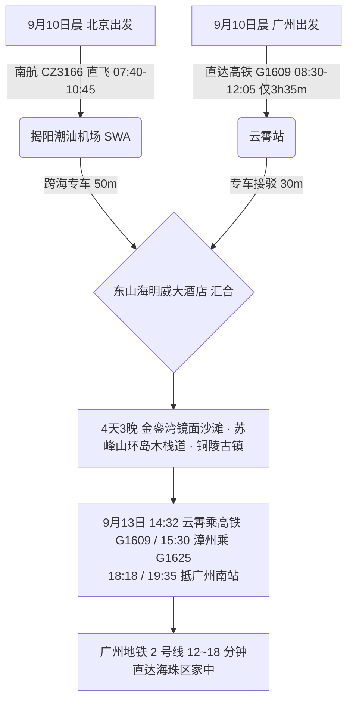

# 2026 福建漳州东山岛 4 天 3 晚天空之镜金銮湾与海岛慢调出行计划导航

> **专案代号**：`zhangzhou`  
> **方案定制机构**：华夏纵横文旅智库旅行社  
> **出行周期**：2026 年 9 月 10 日（周四中午抵离汇合）至 9 月 13 日（周日傍晚返穗）· 4 天 3 晚  
> **北京端直飞枢纽**：北京大兴 (PKX) · 南航 CZ3166 直飞揭阳潮汕 (SWA 10:45 落地) + 跨海专车 50 分钟直达东山岛  
> **广州长辈高铁枢纽**：广州南站/广州东站 · 直达高铁 G1609 直达云霄站（08:30-12:05，**仅 3h35m**）+ 专车 30 分钟直达东山岛  
> **终到闭环**：直达高铁返广州南站 → 广州地铁 2 号线 12~18 分钟直达海珠区家中圆满闭环  
> **专家联合签发**：总负责人 陆承远 · 规划总监 程若曦 · 特级导游 卫国强 · 历史学者 梁思涵 博士 · 地理学者 顾玄石 博士  
> **合规执行标准**：SOP-GOV-2026-001 内容真实性与商业实体四要素核验标准

---

## 1. 专案核心运筹与双端交通接驳

---

## 2. 漳州东山岛核心看点与适老特色

1. **金銮湾海滩（天然“天空之镜”镜面沙滩）**：
   - 滩长 5000 米，沙质极其细腻平整。每天退潮时分，沙滩表面保留薄薄一层水膜，形成倒映蓝天白云的天然镜面，长辈漫步其上如履平镜；
2. **马銮湾天然海滨浴场（国家 4A 级景区）**：
   - 月牙形天然海湾，无暗礁，沙细浪平，绿树成荫的防风林带设有大量无障碍平坦长廊；
3. **苏峰山环岛海景栈道**：
   - 蓝色纯平木栈道贴海悬空延伸，专车可直抵半山观景台，长辈无需爬山即可饱览全景海天一色；
4. **铜陵古镇与南门湾**：
   - 明代抗倭铜山古城，七彩石屋渔村，平缓海堤吹拂温润海风，品尝鲜甜弹牙的东山小管（白灼鱿鱼）与鲜蒸红鲟。

---

## 3. 文件快速入口

- 📑 [漳州东山岛 4D3N 全景适老规划方案](file:///c:/Users/ASUS/Documents/Code/Local/AGENT-PLAYGROUND/travel-agency/plans/2026-09-05-to-09-13/fujian/zhangzhou/2026-09-10-beijing-to-zhangzhou-4d3n-travel-plan.md)
- 🌐 [漳州东山岛 4D3N 交互式 Web 门户](file:///c:/Users/ASUS/Documents/Code/Local/AGENT-PLAYGROUND/travel-agency/plans/2026-09-05-to-09-13/fujian/zhangzhou/index.html)
- 🔙 [返回福建专区总览](file:///c:/Users/ASUS/Documents/Code/Local/AGENT-PLAYGROUND/travel-agency/plans/2026-09-05-to-09-13/fujian/README.md)
