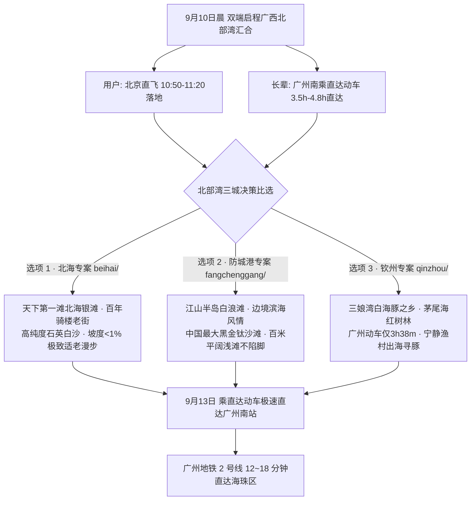

# 2026 广西北部湾 4 天 3 晚纯省外海滨度假专区总览

> **专案代号**：`guangxi`  
> **方案定制机构**：华夏纵横文旅智库旅行社  
> **出行周期**：2026 年 9 月 10 日（周四中午抵离汇合）至 9 月 13 日（周日傍晚返穗）· 4 天 3 晚  
> **北京端直飞枢纽**：北京首都 (PEK) / 北京大兴 (PKX) 早班直飞广西北海福成 (BHY) / 南宁吴圩 (NNG)  
> **广州长辈高铁枢纽**：广州南站搭乘直达动车（D3706 / D3714）3.5~~4.8 小时直达无换乘  
> **终到闭环**：直达动车返回广州南站 → 广州地铁 2 号线 12~~18 分钟直达海珠区  
> **专家联合签发**：总负责人 陆承远 · 规划总监 程若曦 · 特级导游 卫国强 · 历史学者 梁思涵 博士 · 地理学者 顾玄石 博士  
> **合规执行标准**：SOP-GOV-2026-001 内容真实性与商业实体四要素核验标准

---

## 1. 广西北部湾专区战略定位与三城比选

广西北部湾海滨拥有中国大陆最优质的亚热带生态海湾资源。海水水温适宜、沙滩平坦细腻、富硒土壤与红树林湿地带来极高浓度的空气负氧离子，且广州南站始发的南广/广昆高铁走廊实现了 3.5~4.8 小时一站直达，是极其理想的长辈适老海滨康养度假目的地。

---

## 2. 北海、防城港与钦州三城核心维度对比矩阵

| 对比维度           | 【选项 1 · 北海专案】(`beihai/`)                                                 | 【选项 2 · 防城港专案】(`fangchenggang/`)                               | 【选项 3 · 钦州专案】(`qinzhou/`)                                    |
| :----------------- | :------------------------------------------------------------------------------- | :---------------------------------------------------------------------- | :------------------------------------------------------------------- |
| **海滩特色**       | **北海银滩**：国家 5A 级，高纯度石英白沙，滩面宽阔，水清沙细，被称为“中国第一滩” | **白浪滩 (大坪坡)**：中国最大黑金钛沙滩，沙质坚硬平坦如镜，退潮百米平滩 | **三娘湾海滩**：天然金色海湾，中华白海豚栖息地，宁静纯朴天然渔村风情 |
| **沙滩适老性**     | ⭐⭐⭐⭐⭐ (坡度 <1%，无碎石暗礁，踩沙极其轻柔)                                  | ⭐⭐⭐⭐⭐ (沙滩平实不陷脚，推行轮椅或长辈散步零阻力)                   | ⭐⭐⭐⭐☆ (沙滩平缓，风浪小，出海观豚游艇舒适安全)                   |
| **长辈广州高铁**   | **D3706 直达** (广州南 08:08 → 北海 12:28，**4h20m**)                            | **D3706/D3714 直达** (广州南 08:08 → 防城港北 12:55，**4h47m**)         | **D3706 直达** (广州南 08:08 → 钦州东 11:46，**仅 3h38m**)           |
| **用户北京交通**   | **国航 CA1909 直飞** (PEK 07:45 → BHY 11:20 直达)                                | **国航 CA1361 直飞南宁 (10:50 到)** + 专车 45 分钟                      | **国航 CA1361 直飞南宁** + 动车 30 分钟 / 专车直达                   |
| **特色美食与养生** | 北海沙蟹汁、清蒸石斑鱼、合浦大月饼、侨港糖水                                     | 防城港富硒海鸭蛋、金花茶慢炖海参、京族卷粉                              | 钦州大蚝（中国大蚝之乡，肉质肥美）、灵山荔枝蜜、猪脚粉               |
| **推荐下榻酒店**   | `北海银滩皇冠假日酒店` (直通银滩景区)                                            | `防城港荣兴格兰云天大酒店` (北部湾大道)                                 | `钦州天骄国际大酒店` (永福西大街)                                    |
| **品质预算参考**   | 约 ¥2,480 元/人（含大交通、高端海景房、专车及涉海险）                            | 约 ¥2,260 元/人                                                         | 约 ¥2,150 元/人                                                      |

---

## 3. 子目录导航与全景案卷

- 🌊 **选项 1 · 北海专案**：[`beihai/`](file:///c:/Users/ASUS/Documents/Code/Local/AGENT-PLAYGROUND/travel-agency/plans/2026-09-05-to-09-13/guangxi/beihai/)
  - [北海 4D3N 全景适老规划方案](file:///c:/Users/ASUS/Documents/Code/Local/AGENT-PLAYGROUND/travel-agency/plans/2026-09-05-to-09-13/guangxi/beihai/2026-09-10-beijing-to-beihai-4d3n-travel-plan.md)
  - [北海交互式 Web 门户](file:///c:/Users/ASUS/Documents/Code/Local/AGENT-PLAYGROUND/travel-agency/plans/2026-09-05-to-09-13/guangxi/beihai/index.html)
- 🏖️ **选项 2 · 防城港专案**：[`fangchenggang/`](file:///c:/Users/ASUS/Documents/Code/Local/AGENT-PLAYGROUND/travel-agency/plans/2026-09-05-to-09-13/guangxi/fangchenggang/)
  - [防城港 4D3N 全景适老规划方案](file:///c:/Users/ASUS/Documents/Code/Local/AGENT-PLAYGROUND/travel-agency/plans/2026-09-05-to-09-13/guangxi/fangchenggang/2026-09-10-beijing-to-fangchenggang-4d3n-travel-plan.md)
  - [防城港交互式 Web 门户](file:///c:/Users/ASUS/Documents/Code/Local/AGENT-PLAYGROUND/travel-agency/plans/2026-09-05-to-09-13/guangxi/fangchenggang/index.html)
- 🐬 **选项 3 · 钦州专案**：[`qinzhou/`](file:///c:/Users/ASUS/Documents/Code/Local/AGENT-PLAYGROUND/travel-agency/plans/2026-09-05-to-09-13/guangxi/qinzhou/)
  - [钦州 4D3N 全景适老规划方案](file:///c:/Users/ASUS/Documents/Code/Local/AGENT-PLAYGROUND/travel-agency/plans/2026-09-05-to-09-13/guangxi/qinzhou/2026-09-10-beijing-to-qinzhou-4d3n-travel-plan.md)
  - [钦州交互式 Web 门户](file:///c:/Users/ASUS/Documents/Code/Local/AGENT-PLAYGROUND/travel-agency/plans/2026-09-05-to-09-13/guangxi/qinzhou/index.html)
- 🔙 **返回海陆双轴总目录**：[`../README.md`](file:///c:/Users/ASUS/Documents/Code/Local/AGENT-PLAYGROUND/travel-agency/plans/2026-09-05-to-09-13/README.md)
