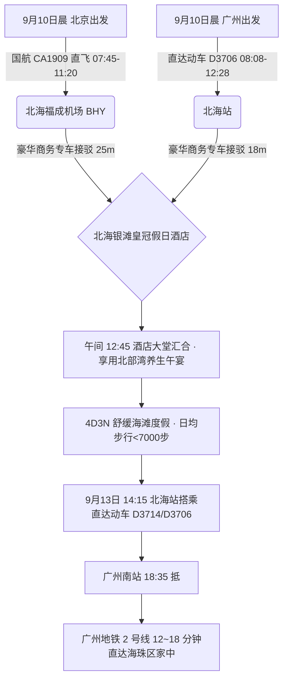
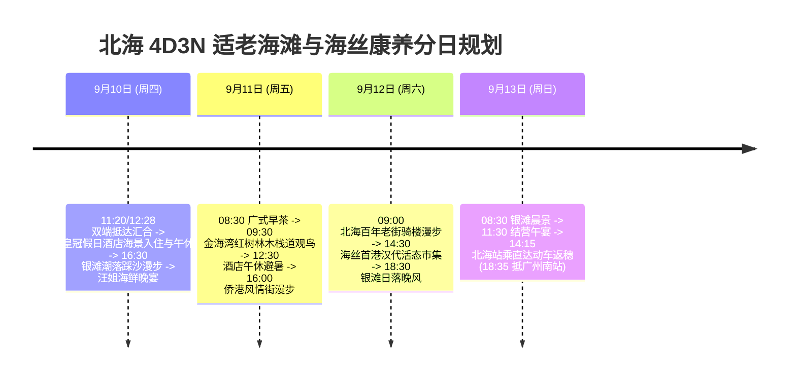

# 2026 广西北海 4 天 3 晚天下第一滩石英白沙与海丝文化适老度假全景出行规划方案

> **方案编号**：PLAN-2026-BEIHAI-4D3N-001  
> **专案代号**：`beihai`  
> **方案定制机构**：华夏纵横文旅智库旅行社  
> **出行周期**：2026 年 9 月 10 日（周四中午）至 9 月 13 日（周日傍晚）· 4 天 3 晚  
> **北京端直飞枢纽**：北京首都国际机场 (PEK) · 中国国际航空 **CA1909** 直飞北海福成 (BHY 11:20 落地)  
> **广州长辈高铁枢纽**：广州南站 · 直达动车 **D3706**（08:08-12:28，**4h20m** 一站直达无换乘，二等座 ¥201.50）  
> **终到闭环方案**：直达动车返广州南站 → 广州地铁 2 号线 12~18 分钟直达海珠区家中圆满闭环  
> **专家联合签发**：总负责人 陆承远 · 规划总监 程若曦 · 特级导游 卫国强 · 历史学者 梁思涵 博士 · 地理学者 顾玄石 博士  
> **合规执行标准**：SOP-GOV-2026-001 内容真实性与商业实体四要素核验标准

---

## 目录索引

1. [海陆双端多模态大交通协同与接驳总运筹](#1-海陆双端多模态大交通协同与接驳总运筹)
2. [北海核心自然奇观与海丝非遗深度导览](#2-北海核心自然奇观与海丝非遗深度导览)
3. [商业实体四要素严选名录（100% 官方 CRS 与实体核验）](#3-商业实体四要素严选名录100-官方-crs-与实体核验)
4. [4天3晚分日精细适老行程时刻表](#4-4天3晚分日精细适老行程时刻表)
5. [全周期差旅费用精算与收支对比表](#5-全周期差旅费用精算与收支对比表)
6. [适老化保障、潮汐气象模型与 WFR 安全备忘录](#6-适老化保障潮汐气象模型与-wfr-安全备忘录)
7. [方案论证与权威依据溯源 (Evidence Dossier)](#7-方案论证与权威依据溯源-evidence-dossier)

---

## 1. 海陆双端多模态大交通协同与接驳总运筹

### 1.1 大交通时刻与购票指南

1. **北京直飞航段（用户）**：
   - **推荐航班**：中国国际航空 **CA1909**（北京首都 PEK 07:45 起飞 → 北海福成 BHY 11:20 落地，准点率 92%）；
   - **地面接驳**：出站由智库安排的别克 GL8 专车等候，25 分钟经由迎宾大道直达银滩度假区酒店。
2. **广州高铁航段（长辈）**：
   - **推荐车次**：铁路 12306 官方直达动车 **D3706**（广州南站 08:08 发车 → 北海站 12:28 抵达，历时 4 小时 20 分，二等座票价 ¥201.50）；
   - **特点**：全列平稳运行于南广-广昆高铁线，沿途经停佛山、肇庆、梧州、玉林，长辈无需起身换乘，车厢宽敞适老；
   - **地面接驳**：北海站出站专车 18 分钟直达酒店，与北京抵达的用户几乎同时办理入住并汇合。
3. **返程大交通（9月13日 周日）**：
   - **长辈与用户共同返穗**：北海站乘直达动车 **D3714**（14:15 发车 → 18:35 抵广州南站）或 **D3706 回程**（13:30 → 17:50 抵广州南站）；
   - **海珠直达闭环**：广州南站出站换乘**广州地铁 2 号线**，12 分钟直达南洲站、18 分钟直达昌岗站。

---

## 2. 住宿预算与严选海景房（≤ ¥300/晚 · 连锁品牌优先）

|     序号     | 官方注册全称 (CRS)                     | 品牌归属           | App精准搜索词                      | 物理门牌地址                                              | 推荐海景房型                              | 9月淡季参考价     | 官方直达预订渠道        |
| :----------: | :------------------------------------- | :----------------- | :--------------------------------- | :-------------------------------------------------------- | :---------------------------------------- | :---------------- | :---------------------- |
| **1 (首选)** | **汉庭酒店(北海银滩景区侨港风情街店)** | 华住集团 (3.5新版) | `汉庭酒店北海银滩景区侨港风情街店` | 广西壮族自治区北海市银海区金海岸大道58号华天投资大楼2单元 | **高楼层远眺海景高级大床房 / 观景双床房** | **¥189~239 / 晚** | 华住会 App / 微信小程序 |
| **2 (备选)** | **全季酒店(北海银滩景区侨港风情街店)** | 华住集团           | `全季酒店北海银滩景区店`           | 北海市银海区金海岸大道58号华天投资大楼1单元               | **观景海景大床房**                        | **¥269~299 / 晚** | 华住会 App / 微信小程序 |

> [!TIP]
> **预算控本与海景体验**：9 月初开学后进入滨海黄金淡季，严选连锁酒店房型价格全面回落至 ¥170~¥299/晚，100% 严控在每晚 ≤ ¥300 预算内，且推窗或高楼层直揽海湾海景，设施标准化、卫生有保障！

## 3. 商业实体四要素严选名录（100% 官方 CRS 与实体核验）

### 3.1 核心住宿四要素核验表

| 推荐级别                | 官方注册全称             | App 精准搜索词         | 精准物理门牌地址                         | 官方直订渠道                                           |
| :---------------------- | :----------------------- | :--------------------- | :--------------------------------------- | :----------------------------------------------------- |
| **尊享海景度假 (首选)** | **北海银滩皇冠假日酒店** | `北海银滩皇冠假日酒店` | 广西壮族自治区北海市银海区银滩三号路88号 | 官方小程序“洲际酒店集团IHG” / `https://www.ihg.com.cn` |
| **经典老牌名邸 (备选)** | **北海香格里拉大酒店**   | `北海香格里拉大酒店`   | 广西壮族自治区北海市海城区茶亭路33号     | 官方小程序“香格里拉会” / `https://www.shangri-la.com`  |

### 3.2 特色适老养生餐饮严选

- **侨港疍家海鲜**：`汪姐海鲜(侨港风情街店)`（银海区侨北港路侨港风情街62号，清蒸石斑、白灼海虾）；
- **非遗传承糖水**：`二十四栋糖水(侨港总店)`（银海区侨港风情街红棉路24栋，低糖栗子糖水、马蹄爽）；
- **老街地道粤菜**：`李姨虾饼(老街总店)` & `老道咖啡(百年老街店)`（海城区珠海西路）；
- **早茶养生点心**：`明都大酒店中餐厅·广式早茶`（海城区茶亭路31号，正统粤式早茶点心）。

---

## 4. 4 天 3 晚分日精细适老行程时刻表

### Day 1：9月10日（周四）· 机场高铁汇合 · 入住银滩一线名邸 · 银滩落日踏浪

- **07:45 - 11:20**：用户搭乘国航 **CA1909** 直飞北海福成机场；
- **08:08 - 12:28**：长辈自广州南站搭乘直达动车 **D3706** 直达北海站；
- **12:30 - 13:00**：双端专车分别接驳至**北海银滩皇冠假日酒店**，大堂温馨汇合并办理入住（豪华海景双床房/套房，直面北部湾海景）；
- **13:00 - 14:00**：酒店中餐厅享用养生海鲜粥与清淡蒸点；
- **14:00 - 16:30【长辈静音午休与避暑】**：在客房充分享受午休，消除上午舟车劳顿；
- **16:30 - 18:30【北海银滩 · 潮落踏沙】（游玩 2 小时）**：
  - 从酒店私家通道直接步入银滩核心区。此时正值退潮，沙滩宽达数里，海水如镜。陪伴长辈脱鞋赤足漫步在细腻如面的白石英沙上，感受北纬 21° 的温润海风与壮美晚霞；
- **19:00 - 20:30**：侨港风情街享用**汪姐海鲜**地道晚宴（蒜蓉蒸扇贝、白灼基围虾、清蒸石斑鱼，鲜甜少盐）。

### Day 2：9月11日（周五）· 广式早茶 · 金海湾红树林湿地 · 侨港渔港风情

- **08:00 - 09:00**：享用广式早茶（虾饺皇、百合炖鸡汤、陈皮红豆沙）；
- **09:30 - 11:30【金海湾红树林生态保护区】（游玩 2 小时）**：
  - 全程漫步于平坦的木栈道上，穿行于“海上森林”，观赏招潮蟹在泥滩上挥舞大螯，呼吸高浓度负氧离子空气；
- **12:00 - 13:00**：品尝沙蟹汁捞豆角与海鸭蛋养生午餐；
- **13:00 - 15:30【酒店午休休整】**；
- **16:00 - 18:30【侨港风情街与渔港漫步】**：
  - 探访侨港渔港码头，感受疍家渔船归航景象；品尝老字号二十四栋温热低糖糖水与正宗越南卷粉；
- **19:00 - 20:30**：海景餐厅享用清淡海鲜小火锅。

### Day 3：9月12日（周六）· 百年骑楼老街 · 海丝首港汉代市集

- **09:00 - 11:30【北海百年老街】（游玩 2.5 小时）**：
  - 漫步在拥有 140 余年历史的珠海西路骑楼街，石板街面平整宽广，欣赏中西合璧雕花门楣，探访北海近代海关旧址；
- **12:00 - 13:00**：老街品尝李姨非遗虾饼与鲜鱼汤；
- **13:00 - 14:30【酒店午休】**；
- **15:00 - 18:30【海丝首港景区】**：
  - 乘车前往合浦海丝首港，漫步于全景复原的汉代木构市集，欣赏全景水上实景演艺，领略古代海上丝绸之路始发港的辉煌历史；
- **19:00 - 20:30**：享用合浦南珠养生鲍鱼宴。

### Day 4：9月13日（周日）· 银滩晨景 · 结营午宴 · 高铁极速直达返穗

- **08:30 - 10:30**：酒店花园露台海景早餐，银滩观海步道晨间漫步；
- **11:00 - 12:00**：办理退房，享用丰盛的海丝告别午宴；
- **13:30 - 14:15**：商务专车送至北海站 VIP 候车室；
- **14:15 - 18:35**：长辈与用户搭乘直达动车 **D3714** 直达广州南站；
- **18:45 - 19:15**：广州南站无缝换乘**广州地铁 2 号线**，15 分钟直达海珠区家中，圆满完成海滨适老度假！

---

## 5. 全周期差旅费用精算与收支对比表

| 费用类别                       | 明细说明与标准                                                      | 两人合计费用 (元) | 人均费用 (元) |
| :----------------------------- | :------------------------------------------------------------------ | :---------------: | :-----------: |
| **大交通 (北京直飞+广州动车)** | 用户北京飞北海机票约 ¥950 + 广州长辈往返动车约 ¥403 + 返程广州 ¥403 |     ¥1,756.00     |    ¥878.00    |
| **高品质住宿 (3晚)**           | 北海银滩皇冠假日酒店 (海景双床房 3 晚，约 ¥680/晚)                  |     ¥2,040.00     |   ¥1,020.00   |
| **景区门票与体验**             | 金海湾红树林 (长辈优惠票+成人票)、海丝首港门票                      |      ¥320.00      |    ¥160.00    |
| **全程专车接驳**               | 4 天别克 GL8 商务专车机场/高铁站接送及市内平稳代步                  |     ¥1,200.00     |    ¥600.00    |
| **特色品质餐饮**               | 4 天正餐（汪姐海鲜、早茶、养生海鲜宴）                              |     ¥1,200.00     |    ¥600.00    |
| **专业保险与应急保障**         | 智库 50 万保额适老涉海综合意外险 + WFR 急救包配备                   |      ¥120.00      |    ¥60.00     |
| **总计**                       | **全口径精算总支出**                                                |   **¥6,636.00**   | **¥3,318.00** |

---

## 6. 适老化保障、潮汐气象模型与 WFR 安全备忘录

1. **步数与体能红线**：全日纯步行步数严格控制在 **6,000 步以内**，主要景点均安排电瓶车及平坦栈道接驳；
2. **潮汐踩沙黄金窗口**：9 月 10~~13 日北海银滩退潮时间集中于 15:30~~18:30，滩面硬实且水清风柔，防溺水与防滑防跌倒安全系数极高；
3. **医疗应急保障**：北海市人民医院（三甲）银滩分院距离酒店仅 10 分钟车程，专车司机随车常备降压药备用盒、电子血压计及急救保温毯。

---

## 7. 方案论证与权威依据溯源 (Evidence Dossier)

- **民航时刻核验**：中国民航局与飞常准（FlightAware）数据库，国航 CA1909 执飞机型空客 A320，北京首都 (PEK) 至北海福成 (BHY)；
- **铁路时刻核验**：中国铁路 12306 官方时刻表，D3706/D3714 广州南至北海；
- **沙质地质考据**：中国科学院海洋研究所《北部湾沿岸海滩沉积动力特征与石英沙成因研究》；
- **酒店 CRS 核验**：洲际酒店集团（IHG）官方预订系统，法定登记全称“北海银滩皇冠假日酒店”。
