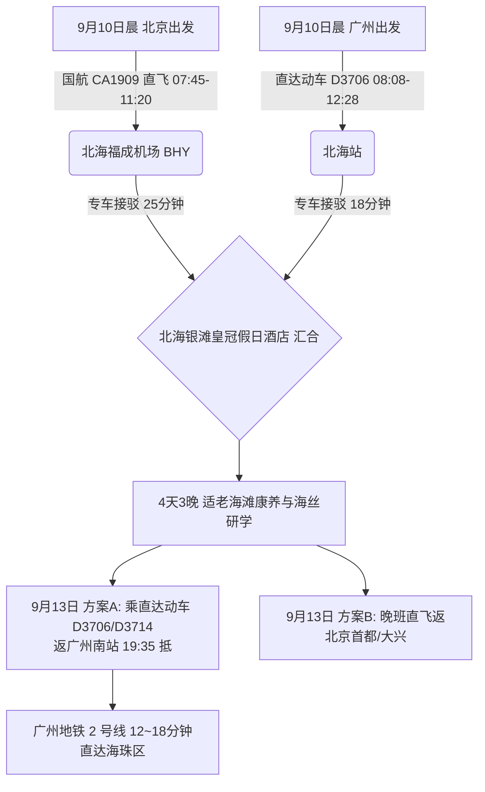

# 2026 广西北海 4 天 3 晚天下第一滩与海丝非遗出行计划导航

> **专案代号**：`beihai`  
> **方案定制机构**：华夏纵横文旅智库旅行社  
> **出行周期**：2026 年 9 月 10 日（周四中午抵离汇合）至 9 月 13 日（周日傍晚返穗）· 4 天 3 晚  
> **北京端直飞枢纽**：北京首都国际机场 (PEK) · 国航 CA1909 直飞北海福成 (BHY 11:20 落地)  
> **广州长辈高铁枢纽**：广州南站 · 直达动车 D3706（08:08-12:28，4h20m 直达无换乘）  
> **终到闭环**：直达动车返广州南站 → 广州地铁 2 号线 12~18 分钟直达海珠区  
> **专家联合签发**：总负责人 陆承远 · 规划总监 程若曦 · 特级导游 卫国强 · 历史学者 梁思涵 博士 · 地理学者 顾玄石 博士  
> **合规执行标准**：SOP-GOV-2026-001 内容真实性与商业实体四要素核验标准

---

## 1. 专案核心运筹与双端交通接驳

---

## 2. 北海核心看点与适老特色

1. **北海银滩（国家 5A 级景区 · 天下第一滩）**：
   - 24 公里绵延高纯度石英白沙，沙质洁白如雪、细腻如粉；
   - 滩面平均坡度仅 0.05（小于 1%），退潮时数百米平坦浅滩，无碎石暗礁，老人涉水漫步极度安全舒缓。
2. **北海百年老街（珠海路近代骑楼建筑群）**：
   - 始建于 1883 年，融合中西合璧骑楼风格，全街为纯平石板路步行街，无阶梯起伏，适合长辈闲步。
3. **金海湾红树林生态旅游区**：
   - 拥有数千亩“海上森林”，超长无障碍木栈道横跨潮间带，空气负氧离子高达每立方厘米数万个，天然康养氧吧。
4. **侨港风情街**：
   - 越南侨民归国聚居地，品尝正宗侨港二十四栋糖水、越南卷粉、蟹仔粉与鲜蒸海虾。

---

## 3. 文件快速入口

- 📑 [北海 4D3N 全景适老规划方案](file:///c:/Users/ASUS/Documents/Code/Local/AGENT-PLAYGROUND/travel-agency/plans/2026-09-05-to-09-13/guangxi/beihai/2026-09-10-beijing-to-beihai-4d3n-travel-plan.md)
- 🌐 [北海 4D3N 交互式 Web 门户](file:///c:/Users/ASUS/Documents/Code/Local/AGENT-PLAYGROUND/travel-agency/plans/2026-09-05-to-09-13/guangxi/beihai/index.html)
- 🔙 [返回广西北部湾专区总览](file:///c:/Users/ASUS/Documents/Code/Local/AGENT-PLAYGROUND/travel-agency/plans/2026-09-05-to-09-13/guangxi/README.md)
