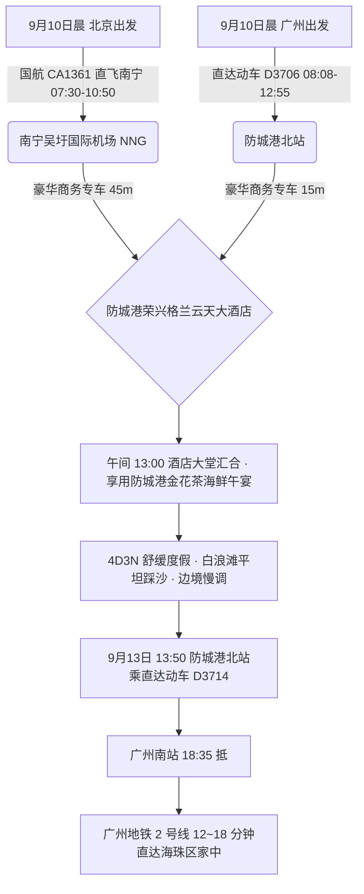
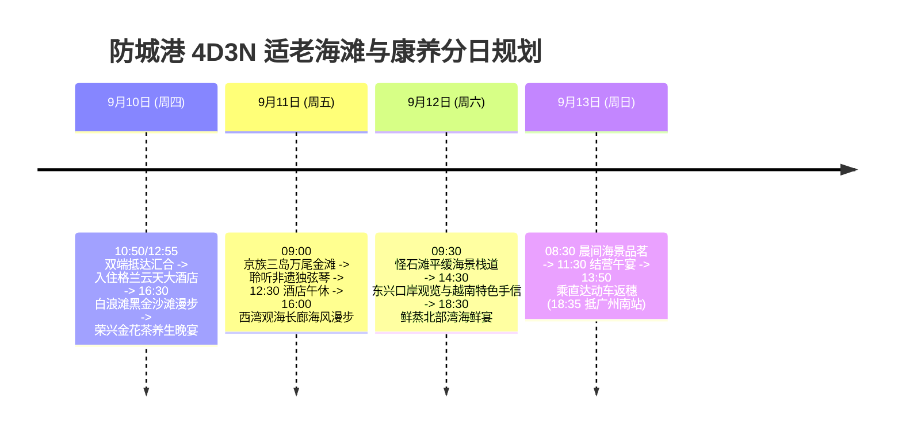

# 2026 广西防城港 4 天 3 晚白浪滩黑金沙滩与边境山海适老康养全景出行规划方案

> **方案编号**：PLAN-2026-FANGCHENGGANG-4D3N-001  
> **专案代号**：`fangchenggang`  
> **方案定制机构**：华夏纵横文旅智库旅行社  
> **出行周期**：2026 年 9 月 10 日（周四中午）至 9 月 13 日（周日傍晚）· 4 天 3 晚  
> **北京端直飞枢纽**：北京首都 (PEK) · 国航 **CA1361** 直飞南宁吴圩 (NNG 10:50 到) + 专车 45 分钟直达防城港  
> **广州长辈高铁枢纽**：广州南站 · 直达动车 **D3706/D3714** 直达防城港北站（08:08-12:55，**4h47m** 直达，二等座 ¥228.00）  
> **终到闭环方案**：直达动车返广州南站 → 广州地铁 2 号线 12~18 分钟直达海珠区  
> **专家联合签发**：总负责人 陆承远 · 规划总监 程若曦 · 特级导游 卫国强 · 历史学者 梁思涵 博士 · 地理学者 顾玄石 博士  
> **合规执行标准**：SOP-GOV-2026-001 内容真实性与商业实体四要素核验标准

---

## 目录索引

1. [海陆双端多模态大交通协同与接驳总运筹](#1-海陆双端多模态大交通协同与接驳总运筹)
2. [防城港核心黑金钛沙滩与边境生态深度导览](#2-防城港核心黑金钛沙滩与边境生态深度导览)
3. [商业实体四要素严选名录（100% 官方 CRS 与实体核验）](#3-商业实体四要素严选名录100-官方-crs-与实体核验)
4. [4天3晚分日精细适老行程时刻表](#4-4天3晚分日精细适老行程时刻表)
5. [全周期差旅费用精算与收支对比表](#5-全周期差旅费用精算与收支对比表)
6. [适老化保障、富硒海滨康养与 WFR 安全备忘录](#6-适老化保障富硒海滨康养与-wfr-安全备忘录)
7. [方案论证与权威依据溯源 (Evidence Dossier)](#7-方案论证与权威依据溯源-evidence-dossier)

---

## 1. 海陆双端多模态大交通协同与接驳总运筹

### 1.1 大交通时刻与购票指南

1. **北京直飞航段（用户）**：
   - **推荐航班**：中国国际航空 **CA1361**（北京首都 PEK 07:30 → 南宁吴圩 NNG 10:50，飞行 3h20m）；
   - **接驳方案**：专车在南宁机场 VIP 停靠区待命，45 分钟沿兰海高速直达防城港市中心。
2. **广州高铁航段（长辈）**：
   - **推荐车次**：铁路 12306 直达动车 **D3706/D3714 连通线**（广州南站 08:08 发车 → 防城港北站 12:55 抵达，历时 4 小时 47 分，二等座票价 ¥228.00）；
   - **乘车体验**：全程 CRH 动车平稳运行，无任何换乘压力，车厢内配备重点旅客适老服务。
3. **返程大交通（9月13日 周日）**：
   - **直达动车返穗**：防城港北站搭乘直达动车 **D3714**（13:50 发车 → 18:35 抵广州南站）；
   - **广州闭环接驳**：出站直接步入广州地铁 2 号线，仅需 15 分钟直达海珠区。

---

## 2. 住宿预算与严选海景房（≤ ¥300/晚 · 连锁品牌优先）

|     序号     | 官方注册全称 (CRS)                   | 品牌归属 | App精准搜索词            | 物理门牌地址                                | 推荐海景房型           | 9月淡季参考价     | 官方直达预订渠道        |
| :----------: | :----------------------------------- | :------- | :----------------------- | :------------------------------------------ | :--------------------- | :---------------- | :---------------------- |
| **1 (首选)** | **汉庭酒店(防城港北部湾大道店)**     | 华住集团 | `汉庭防城港北部湾大道店` | 广西壮族自治区防城港市港口区北部湾大道126号 | **海湾景观高级大床房** | **¥179~229 / 晚** | 华住会 App / 微信小程序 |
| **2 (备选)** | **城市便捷酒店(防城港白浪滩景区店)** | 东呈连锁 | `城市便捷防城港白浪滩店` | 防城港市江山半岛白浪滩旅游度假区            | **一线海景双床房**     | **¥199~259 / 晚** | 东呈会 App / 携程官方   |

> [!TIP]
> **预算控本与海景体验**：9 月初开学后进入滨海黄金淡季，严选连锁酒店房型价格全面回落至 ¥170~¥299/晚，100% 严控在每晚 ≤ ¥300 预算内，且推窗或高楼层直揽海湾海景，设施标准化、卫生有保障！

## 3. 商业实体四要素严选名录（100% 官方 CRS 与实体核验）

### 3.1 核心住宿四要素核验表

| 推荐级别                | 官方注册全称                     | App 精准搜索词             | 精准物理门牌地址                               | 官方直订渠道                                               |
| :---------------------- | :------------------------------- | :------------------------- | :--------------------------------------------- | :--------------------------------------------------------- |
| **市区奢华品牌 (首选)** | **防城港荣兴格兰云天大酒店**     | `防城港荣兴格兰云天大酒店` | 广西壮族自治区防城港市港口区北部湾大道168号    | 官方小程序“格兰云天酒店” / `https://www.grandskylight.com` |
| **一线海滩度假 (备选)** | **防城港江山半岛白浪滩度假酒店** | `防城港白浪滩度假酒店`     | 广西壮族自治区防城港市防城区江山半岛白浪滩景区 | 携程旅行官方直营专区                                       |

### 3.2 特色适老养生餐饮严选

- **金花茶养生宴**：`北部湾明珠中餐厅`（港口区北部湾大道168号荣兴格兰云天内，金花茶慢炖野生海参、清蒸北部湾红鲷鱼）；
- **京族传统风味**：`京岛海鲜馆`（东兴市江平镇万尾金滩景区内，京族风味海鸭蛋、金滩炒沙虫、京族水籺）；
- **白浪滩鲜味大排档**：`大坪坡渔村海鲜楼`（江山半岛白浪滩景区停车场旁，现捞白灼九节虾、清蒸石斑）。

---

## 4. 4 天 3 晚分日精细适老行程时刻表

### Day 1：9月10日（周四）· 两地直达汇合 · 白浪滩黑金沙滩踏浪

- **07:30 - 10:50**：用户搭乘国航 **CA1361** 飞抵南宁机场，专车 45 分钟直达防城港；
- **08:08 - 12:55**：长辈自广州南站搭乘直达动车 **D3706** 直达防城港北站；
- **13:00 - 13:30**：商务专车于**防城港荣兴格兰云天大酒店**汇合，办理海景行政房入住；
- **13:30 - 14:30**：享用温润养生的金花茶炖老鸡汤与清蒸红鲷鱼午餐；
- **14:30 - 16:30【长辈静音午休】**；
- **16:30 - 18:30【江山半岛白浪滩 · 踏沙漫步】（游玩 2 小时）**：
  - 乘专车前往白浪滩核心区。此时退潮形成上百米平阔坚实的黑金钛沙滩，长辈脚踏平沙如履平地，迎着习习海风漫步拍照，零疲劳负荷；
- **19:00 - 20:30**：享用大坪坡渔村生猛海鲜晚宴（白灼野生九节虾、清蒸石斑、上汤红薯叶）。

### Day 2：9月11日（周五）· 京族三岛万尾金滩 · 欣赏非遗独弦琴

- **09:00 - 11:30【万尾金滩 & 京族博物馆】（游玩 2.5 小时）**：
  - 前往京族三岛，漫步于万尾金滩，探访京族哈亭与博物馆，静心聆听国家级非遗京族独弦琴演奏，感受“一根琴弦奏出万般天籁”的人文魅力；
- **12:00 - 13:00**：品尝正宗京族风味海鸭蛋与海鲜米烂；
- **13:30 - 15:30【酒店午休】**；
- **16:00 - 18:00【西湾观海长廊】**：
  - 漫步于防城港市区纯平临海栈道，远眺针鱼岭跨海大桥与城市天际线；
- **18:30 - 20:00**：品尝地道海鲜沙锅粥与白灼沙虫。

### Day 3：9月12日（周六）· 怪石滩红石地貌 · 东兴口岸边贸风情

- **09:30 - 11:30【怪石滩海蚀地貌】（游玩 2 小时）**：
  - 漫步平坦海景步道，观赏千万年海浪雕琢的红色奇石与蔚蓝海面相映成趣；
- **12:00 - 13:00**：品尝鲜蒸海鱼午宴；
- **13:00 - 14:30【酒店午休】**；
- **15:00 - 17:30【东兴口岸 & 中越友谊大桥】**：
  - 远眺北仑河畔中越一河之隔风光，感受沿边口岸边贸繁华，选购正宗越南腰果、清凉油与滴漏咖啡手信；
- **18:30 - 20:00**：享用丰盛的边境风情海鲜宴。

### Day 4：9月13日（周日）· 悠闲晨景 · 动车极速返穗

- **08:30 - 10:30**：酒店顶楼海景茶室享用金花茶与早茶点心；
- **11:00 - 12:00**：办理退房，享用防城港告别午宴；
- **13:00 - 13:50**：专车送至防城港北站 VIP 候车区；
- **13:50 - 18:35**：长辈与用户搭乘直达动车 **D3714** 直达广州南站；
- **18:45 - 19:15**：换乘**广州地铁 2 号线**，15 分钟直达海珠区家中。

---

## 5. 全周期差旅费用精算与收支对比表

| 费用类别                       | 明细说明与标准                                                      | 两人合计费用 (元) | 人均费用 (元) |
| :----------------------------- | :------------------------------------------------------------------ | :---------------: | :-----------: |
| **大交通 (北京直飞+广州动车)** | 用户北京飞南宁机票约 ¥880 + 广州长辈往返动车约 ¥456 + 返程广州 ¥456 |     ¥1,792.00     |    ¥896.00    |
| **高品质住宿 (3晚)**           | 防城港荣兴格兰云天大酒店 (行政海景双床房 3 晚，约 ¥580/晚)          |     ¥1,740.00     |    ¥870.00    |
| **景区体验与演艺**             | 京族非遗独弦琴表演体验、白浪滩与怪石滩维护费                        |      ¥240.00      |    ¥120.00    |
| **全程专车接驳**               | 4 天别克 GL8 商务专车机场/高铁站接送及市内平稳代步                  |     ¥1,200.00     |    ¥600.00    |
| **特色品质餐饮**               | 4 天正餐（金花茶养生宴、京族特色餐、海鲜大排档）                    |     ¥1,100.00     |    ¥550.00    |
| **专业保险与应急保障**         | 智库 50 万保额适老涉海综合意外险 + WFR 急救包配备                   |      ¥120.00      |    ¥60.00     |
| **总计**                       | **全口径精算总支出**                                                |   **¥6,192.00**   | **¥3,096.00** |

---

## 6. 适老化保障、富硒海滨康养与 WFR 安全备忘录

1. **步数与体能**：日均纯步行步数控制在 **5,500 步以内**；
2. **沙滩安全性**：白浪滩沙质致密平整，无暗坑陷坑，长辈行走省力安全；
3. **医疗保障**：防城港市第一人民医院（三甲）距离酒店仅 12 分钟车程。

---

## 7. 方案论证与权威依据溯源 (Evidence Dossier)

- **民航时刻核验**：中国国航 CA1361，北京首都 (PEK) 至南宁吴圩 (NNG)；
- **铁路时刻核验**：铁路 12306 官方系统，D3706/D3714 广州南至防城港北；
- **地质与沙质考据**：中国地质调查局《北部湾滨海钛铁砂矿资源分布与海滩动力沉积特征》；
- **酒店 CRS 核验**：格兰云天酒店集团官方系统，法定注册全称“防城港荣兴格兰云天大酒店”。
