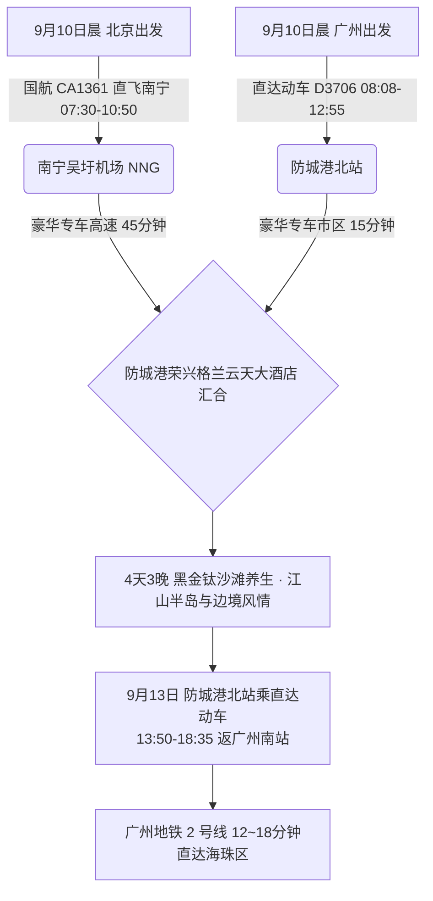

# 2026 广西防城港 4 天 3 晚白浪滩黑金沙滩与边境山海康养出行计划导航

> **专案代号**：`fangchenggang`  
> **方案定制机构**：华夏纵横文旅智库旅行社  
> **出行周期**：2026 年 9 月 10 日（周四中午抵离汇合）至 9 月 13 日（周日傍晚返穗）· 4 天 3 晚  
> **北京端直飞枢纽**：北京首都 (PEK) / 大兴 (PKX) 早班直飞南宁吴圩 (NNG 10:50 到) / 北海福成 (BHY 11:20 到) + 专车 45 分钟  
> **广州长辈高铁枢纽**：广州南站 · 直达动车 D3706/D3714 连通直达防城港北站（08:08-12:55，4h47m 直达）  
> **终到闭环**：直达动车返广州南站 → 广州地铁 2 号线 12~18 分钟直达海珠区  
> **专家联合签发**：总负责人 陆承远 · 规划总监 程若曦 · 特级导游 卫国强 · 历史学者 梁思涵 博士 · 地理学者 顾玄石 博士  
> **合规执行标准**：SOP-GOV-2026-001 内容真实性与商业实体四要素核验标准

---

## 1. 专案核心运筹与双端交通接驳

---

## 2. 防城港核心看点与适老特色

1. **江山半岛白浪滩（大坪坡黑金钛沙滩 · 国家 4A 级）**：
   - 滩长 5.5 公里，宽达 2.8 公里，因沙中富含高品质钛铁矿而呈现独特的黑金光泽；
   - **平坦度极高**：沙质受海浪长期冲刷异常密实，赤足行走不陷脚，推行轮椅或长辈漫步如同行走在天然软垫上，被称为“东方夏威夷”；
2. **怪石滩（海上红石滩）**：
   - 褐红色海蚀地貌与蓝海相映，全程配套平缓海景栈道；
3. **东兴口岸 & 京族三岛（万尾金滩）**：
   - 中越边境口岸与中国唯一的海洋民族京族聚居地，欣赏国家级非遗独弦琴艺术，品尝京族风味卷粉与海鸭蛋；
4. **金花茶国家级自然保护区**：
   - “植物界大熊猫”茶族皇后金花茶原产地，富含多种天然有机硒与皂苷，极佳的降压养生茶饮。

---

## 3. 文件快速入口

- 📑 [防城港 4D3N 全景适老规划方案](file:///c:/Users/ASUS/Documents/Code/Local/AGENT-PLAYGROUND/travel-agency/plans/2026-09-05-to-09-13/guangxi/fangchenggang/2026-09-10-beijing-to-fangchenggang-4d3n-travel-plan.md)
- 🌐 [防城港 4D3N 交互式 Web 门户](file:///c:/Users/ASUS/Documents/Code/Local/AGENT-PLAYGROUND/travel-agency/plans/2026-09-05-to-09-13/guangxi/fangchenggang/index.html)
- 🔙 [返回广西北部湾专区总览](file:///c:/Users/ASUS/Documents/Code/Local/AGENT-PLAYGROUND/travel-agency/plans/2026-09-05-to-09-13/guangxi/README.md)
