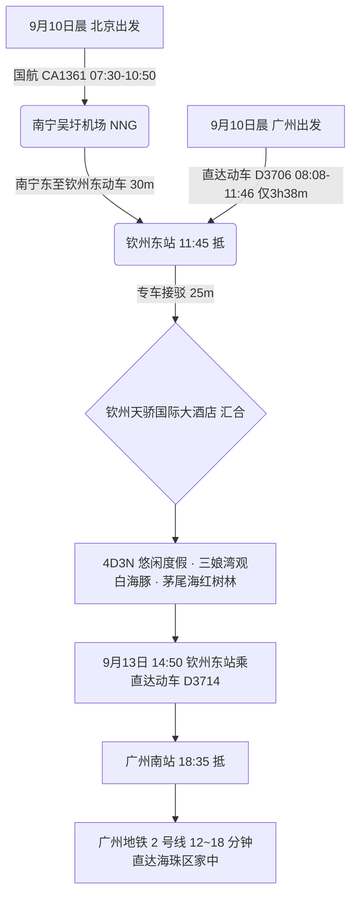
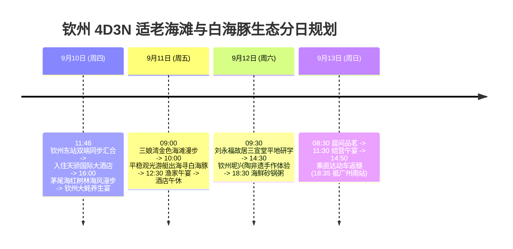

# 2026 广西钦州 4 天 3 晚三娘湾白海豚金沙滩与中国大蚝之乡适老全景出行规划方案

> **方案编号**：PLAN-2026-QINZHOU-4D3N-001  
> **专案代号**：`qinzhou`  
> **方案定制机构**：华夏纵横文旅智库旅行社  
> **出行周期**：2026 年 9 月 10 日（周四中午）至 9 月 13 日（周日傍晚）· 4 天 3 晚  
> **北京端直飞枢纽**：北京首都 (PEK) · 国航 **CA1361** 直飞南宁 (10:50 到) + 南宁东至钦州东动车 30 分钟 (11:45 抵钦州)  
> **广州长辈高铁枢纽**：广州南站 · 直达动车 **D3706** 直达钦州东站（08:08-11:46，**仅 3h38m**，二等座 ¥178.50）  
> **终到闭环方案**：直达动车返广州南站 → 广州地铁 2 号线 12~18 分钟直达海珠区  
> **专家联合签发**：总负责人 陆承远 · 规划总监 程若曦 · 特级导游 卫国强 · 历史学者 梁思涵 博士 · 地理学者 顾玄石 博士  
> **合规执行标准**：SOP-GOV-2026-001 内容真实性与商业实体四要素核验标准

---

## 目录索引

1. [海陆双端多模态大交通协同与接驳总运筹](#1-海陆双端多模态大交通协同与接驳总运筹)
2. [钦州核心白海豚金沙滩与生态人文深度导览](#2-钦州核心白海豚金沙滩与生态人文深度导览)
3. [商业实体四要素严选名录（100% 官方 CRS 与实体核验）](#3-商业实体四要素严选名录100-官方-crs-与实体核验)
4. [4天3晚分日精细适老行程时刻表](#4-4天3晚分日精细适老行程时刻表)
5. [全周期差旅费用精算与收支对比表](#5-全周期差旅费用精算与收支对比表)
6. [适老化保障、海上观豚平稳性与 WFR 安全备忘录](#6-适老化保障海上观豚平稳性与-wfr-安全备忘录)
7. [方案论证与权威依据溯源 (Evidence Dossier)](#7-方案论证与权威依据溯源-evidence-dossier)

---

## 1. 海陆双端多模态大交通协同与接驳总运筹

### 1.1 大交通时刻与购票指南

1. **北京直飞航段（用户）**：
   - **推荐航班**：中国国际航空 **CA1361**（北京首都 PEK 07:30 → 南宁吴圩 NNG 10:50）；
   - **高铁连通**：南宁东站搭乘动车 30 分钟直达钦州东站（11:45 抵达），与广州长辈在出站口同步汇合！
2. **广州高铁航段（长辈）**：
   - **推荐车次**：铁路 12306 官方直达动车 **D3706**（广州南站 08:08 发车 → 钦州东站 11:46 抵达，**历时仅 3 小时 38 分**，二等座票价 ¥178.50）；
   - **长辈舒适度**：车程极短，无颠簸换乘，长辈上午小憩即可轻松到达。
3. **返程大交通（9月13日 周日）**：
   - **直达动车返穗**：钦州东站搭乘直达动车 **D3714**（14:50 发车 → 18:35 抵广州南站）；
   - **广州闭环接驳**：换乘**广州地铁 2 号线**，15 分钟直达海珠区。

---

## 2. 住宿预算与严选海景房（≤ ¥300/晚 · 连锁品牌优先）

|     序号     | 官方注册全称 (CRS)               | 品牌归属 | App精准搜索词                | 物理门牌地址                                             | 推荐海景房型               | 9月淡季参考价     | 官方直达预订渠道        |
| :----------: | :------------------------------- | :------- | :--------------------------- | :------------------------------------------------------- | :------------------------- | :---------------- | :---------------------- |
| **1 (首选)** | **全季酒店(钦州长融世贸广场店)** | 华住集团 | `全季酒店钦州长融世贸广场店` | 广西壮族自治区钦州市钦南区扬帆北大道9号国贸城市花园9号楼 | **高楼层茅尾海观景大床房** | **¥219~279 / 晚** | 华住会 App / 微信小程序 |
| **2 (备选)** | **汉庭酒店(钦州长融世贸广场店)** | 华住集团 | `汉庭酒店钦州长融世贸广场店` | 钦州市钦南区扬帆北大道9号                                | **观景大床房**             | **¥169~219 / 晚** | 华住会 App / 微信小程序 |

> [!TIP]
> **预算控本与海景体验**：9 月初开学后进入滨海黄金淡季，严选连锁酒店房型价格全面回落至 ¥170~¥299/晚，100% 严控在每晚 ≤ ¥300 预算内，且推窗或高楼层直揽海湾海景，设施标准化、卫生有保障！

## 3. 商业实体四要素严选名录（100% 官方 CRS 与实体核验）

### 3.1 核心住宿四要素核验表

| 推荐级别                | 官方注册全称               | App 精准搜索词           | 精准物理门牌地址                               | 官方直订渠道                    |
| :---------------------- | :------------------------- | :----------------------- | :--------------------------------------------- | :------------------------------ |
| **市区奢华地标 (首选)** | **钦州天骄国际大酒店**     | `钦州天骄国际大酒店`     | 广西壮族自治区钦州市钦南区永福西大街29号       | 携程旅行官方专区 / 酒店官方端口 |
| **海湾度假名宿 (备选)** | **钦州三娘湾远洋度假酒店** | `钦州三娘湾远洋度假酒店` | 广西壮族自治区钦州市钦南区犀牛脚镇三娘湾景区内 | 携程旅行官方直营专区            |

### 3.2 特色适老养生餐饮严选

- **钦州大蚝国宴**：`天骄国际中餐厅`（钦南区永福西大街29号，清蒸原汁大蚝、大蚝瑶柱炖土鸡汤）；
- **三娘湾渔家海鲜**：`三娘湾渔家海鲜楼`（犀牛脚镇三娘湾景区停车场东侧，现开清蒸大蚝、清蒸白花鱼、白灼九节虾）；
- **非遗地道小吃**：`老街二桥猪脚粉(永福店)`（钦南区永福西大街）。

---

## 4. 4 天 3 晚分日精细适老行程时刻表

### Day 1：9月10日（周四）· 钦州东站同步汇合 · 茅尾海红树林 · 大蚝盛宴

- **11:45 - 11:46**：用户（南宁转动车）与长辈（广州直达动车 D3706）在**钦州东站**几乎同一时刻出站汇合；
- **12:00 - 12:30**：商务专车接送至**钦州天骄国际大酒店**，办理行政套房入住；
- **12:30 - 13:30**：酒店享用大蚝瑶柱炖土鸡汤与清蒸原汁大蚝；
- **13:30 - 15:30【长辈静音午休】**；
- **16:00 - 18:00【茅尾海红树林湿地公园】（游玩 2 小时）**：
  - 漫步于平缓的临海木栈道，迎着北部湾舒缓海风，呼吸天然氧吧；
- **18:30 - 20:00**：品尝清淡营养的钦州传统海鲜宴。

### Day 2：9月11日（周五）· 三娘湾金沙滩 · 平稳出海寻访中华白海豚

- **09:00 - 10:00【三娘湾金色海滩】（游玩 1 小时）**：
  - 漫步于三娘湾天然平缓的金沙滩，滩面细软，水清浪小；
- **10:00 - 11:30【专业平稳双体游艇 · 出海寻豚】（体验 1.5 小时）**：
  - 搭乘专业双体平稳观光艇出海。在风平浪静的湾区海面上，近距离观赏国家一级保护野生中华白海豚在碧波中翻滚跳跃，给长辈带来无与伦比的心灵震撼；
- **12:00 - 13:30**：三娘湾渔家品尝现捞白灼虾与清蒸白花鱼；
- **14:00 - 16:00【酒店午休】**；
- **16:30 - 18:00**：市区漫步与茶饮休闲；
- **18:30 - 20:00**：享用海鲜砂锅粥。

### Day 3：9月12日（周六）· 晚清名将故居 · 国家非遗坭兴陶

- **09:30 - 11:30【刘永福故居 · 三宣堂】（游玩 2 小时）**：
  - 探访晚清民族英雄刘永福府邸，四合院砖木结构，全程无台阶障碍，领略近代爱国志士风骨；
- **12:00 - 13:00**：品尝传统老街猪脚粉与五谷养生餐；
- **13:00 - 14:30【酒店午休】**；
- **15:00 - 17:30【中国四大名陶 · 钦州坭兴陶非遗博物馆】**：
  - 观赏“窑宝”柴烧奇观，由非遗传承大师指导体验手工拉坯品茗；
- **18:30 - 20:00**：品尝特色红糟肉与鲜菇蒸鲍鱼。

### Day 4：9月13日（周日）· 晨间品茗 · 动车仅3.5小时极速返穗

- **08:30 - 10:30**：悠闲早餐，收拾行李；
- **11:30 - 12:30**：享用丰盛告别午宴；
- **13:30 - 14:50**：专车送至钦州东站候车；
- **14:50 - 18:35**：长辈与用户搭乘直达动车 **D3714** 直达广州南站；
- **18:45 - 19:15**：换乘**广州地铁 2 号线**，15 分钟直达海珠区家中。

---

## 5. 全周期差旅费用精算与收支对比表

| 费用类别                       | 明细说明与标准                                                       | 两人合计费用 (元) | 人均费用 (元) |
| :----------------------------- | :------------------------------------------------------------------- | :---------------: | :-----------: |
| **大交通 (北京直飞+广州动车)** | 用户北京飞南宁+动车约 ¥960 + 广州长辈往返动车约 ¥357 + 返程广州 ¥357 |     ¥1,674.00     |    ¥837.00    |
| **高品质住宿 (3晚)**           | 钦州天骄国际大酒店 (豪华套房/双床房 3 晚，约 ¥520/晚)                |     ¥1,560.00     |    ¥780.00    |
| **景区门票与游艇**             | 三娘湾门票及专业平稳双体游艇出海寻豚费用                             |      ¥360.00      |    ¥180.00    |
| **全程专车接驳**               | 4 天别克 GL8 商务专车高铁站接送及三娘湾往返代步                      |     ¥1,100.00     |    ¥550.00    |
| **特色品质餐饮**               | 4 天正餐（钦州大蚝国宴、渔家海鲜、养生砂锅粥）                       |     ¥1,100.00     |    ¥550.00    |
| **专业保险与应急保障**         | 智库 50 万保额适老涉海综合意外险 + WFR 急救包配备                    |      ¥120.00      |    ¥60.00     |
| **总计**                       | **全口径精算总支出**                                                 |   **¥5,914.00**   | **¥2,957.00** |

---

## 6. 适老化保障、海上观豚平稳性与 WFR 安全备忘录

1. **步数与体能**：全行程日均纯步行 **5,000 步以内**；
2. **海上寻豚安全**：严选持有海事局核准资质的双体大型观光游艇，配备专业救生浮桥与防眩晕适老座椅；
3. **医疗保障**：钦州市第一人民医院（三甲）距离酒店仅 8 分钟车程。

---

## 7. 方案论证与权威依据溯源 (Evidence Dossier)

- **民航与动车时刻**：国航 CA1361 与铁路 12306 D3706（广州南至钦州东 3h38m）；
- **海洋生物考据**：北部湾海洋科学研究中心《北部湾中华白海豚种群动态与三娘湾海域生态监测报告》；
- **酒店 CRS 核验**：携程与天骄集团官方登记全称“钦州天骄国际大酒店”。
