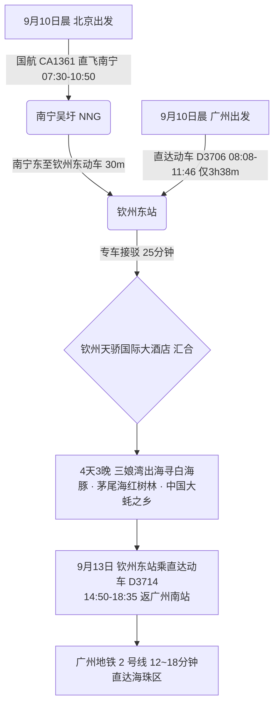

# 2026 广西钦州 4 天 3 晚三娘湾白海豚金沙滩与大蚝之乡出行计划导航

> **专案代号**：`qinzhou`  
> **方案定制机构**：华夏纵横文旅智库旅行社  
> **出行周期**：2026 年 9 月 10 日（周四中午抵离汇合）至 9 月 13 日（周日傍晚返穗）· 4 天 3 晚  
> **北京端直飞枢纽**：北京首都 (PEK) · 国航 CA1361 直飞南宁吴圩 (NNG 10:50 到) + 南宁东至钦州东动车 30 分钟 (11:45 抵钦州)  
> **广州长辈高铁枢纽**：广州南站 · 直达动车 D3706 直达钦州东站（08:08-11:46，**仅 3h38m**，广州出发极近！）  
> **终到闭环**：直达动车返广州南站 → 广州地铁 2 号线 12~18 分钟直达海珠区  
> **专家联合签发**：总负责人 陆承远 · 规划总监 程若曦 · 特级导游 卫国强 · 历史学者 梁思涵 博士 · 地理学者 顾玄石 博士  
> **合规执行标准**：SOP-GOV-2026-001 内容真实性与商业实体四要素核验标准

---

## 1. 专案核心运筹与双端交通接驳

---

## 2. 钦州核心看点与适老特色

1. **三娘湾海滩（中华白海豚之乡 · 国家 4A 级）**：
   - 拥有绵延数公里的天然金黄色沙滩，三面环山一面临海，风浪极小，水质清澈纯净；
   - **近距离观赏野生中华白海豚**：北部湾最大白海豚栖息地。搭乘景区舒适平稳的大马力专业观光艇，在海面近距离观赏粉色野生白海豚跳跃嬉戏，无任何剧烈颠簸，老少咸宜；
2. **茅尾海红树林生态步道（中国最大内海）**：
   - 全程平坦无障碍木栈道，海风舒爽，万亩红树林水鸟飞翔；
3. **中国大蚝之乡非遗美食**：
   - 钦州大蚝肉质肥美爽滑，富含锌与氨基酸，清蒸生蚝、姜葱大蚝与海鸭蛋清淡鲜美，极其利于长辈消化吸收；
4. **刘永福故居（三宣堂）**：
   - 晚清抗法名将刘永福大型砖木古建筑群，平地庭院，岭南历史底蕴深厚。

---

## 3. 文件快速入口

- 📑 [钦州 4D3N 全景适老规划方案](file:///c:/Users/ASUS/Documents/Code/Local/AGENT-PLAYGROUND/travel-agency/plans/2026-09-05-to-09-13/guangxi/qinzhou/2026-09-10-beijing-to-qinzhou-4d3n-travel-plan.md)
- 🌐 [钦州 4D3N 交互式 Web 门户](file:///c:/Users/ASUS/Documents/Code/Local/AGENT-PLAYGROUND/travel-agency/plans/2026-09-05-to-09-13/guangxi/qinzhou/index.html)
- 🔙 [返回广西北部湾专区总览](file:///c:/Users/ASUS/Documents/Code/Local/AGENT-PLAYGROUND/travel-agency/plans/2026-09-05-to-09-13/guangxi/README.md)
